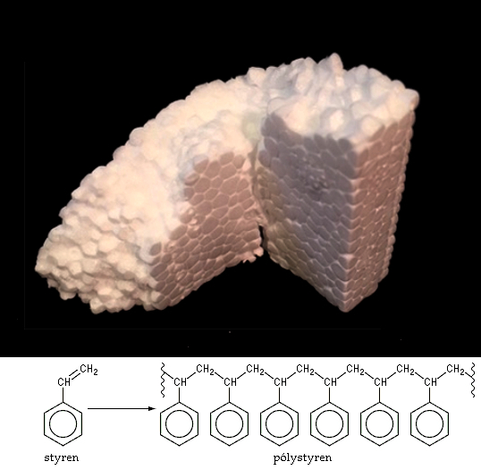
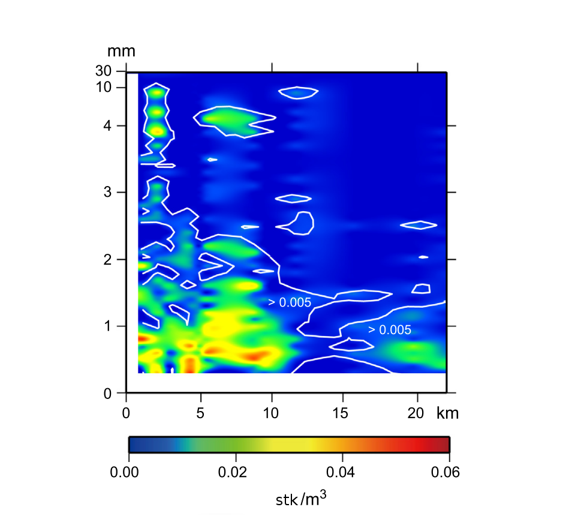
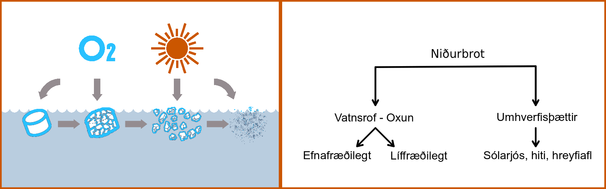

---
output:
  pdf_document: default
  html_document: default
---
# Almennt um plast
## Grunneining plasts: fjölliður plastefna {-}

Einn stærsti áhrifavaldur 20. aldarinnar á daglegt líf fólks var uppgötvun og hönnun plasts og óhætt er að segja að kaflaskil hafi átt sér stað í framhaldi af því að plastefnið Bakelite var fundið upp árið 1909. Plast leysti af hólmi mörg önnur efni í iðnaði og á heimilum vegna þess, fyrst og fremst, hve ódýrt það er í framleiðslu og hversu slitsterkt það er. Vegna margvíslegra eftirsóttra eiginleika plasts hefur það verið aðlagað að flestum kimum í mannlegu samfélagi. Frá því fjöldaframleiðsla þess hófst er talið að yfir 8 miljarðar tonna hafi verið framleiddir í heiminum og meirihluti þess endað sem úrgangur [@geyer2017production]. Plast brotnar ekki auðveldlega niður ^[Niðurbrot (e. degradation og fragmentation) er ólíkt sundrun (e. mineralization). Niðurbrot er þegar plast brotnar í minni einingar en niðurbrot er þegar grunneining efnisins breytist.] í náttúrunni og safnast því upp þar með ófyrirséðum afleiðingum.

```{r include=FALSE}
library(BiocStyle)
library(magrittr)
```

Það sem við köllum plast í daglegu tali er almennt blanda af fjölliðum plastefna og bætiefnum en hin síðarnefndu gefa plastinu ýmsa eiginleika sem auka notagildi þess. Fjölliður plastefna eru framleiddar úr einliðum sem eru yfirleitt ekki nema nokkur atóm að stærð eins og t.d. etylen sem hefur efnaformúluna $C~2H~4$. Hver fjölliða getur verið samsett úr þúsundum einliða og er hægt að framleiða fjölmargar ólíkar plastgerðir úr mismunandi samsetningum einliða. Fjölliða etýlens kallast því t.d. pólýetýlen og hefur efnaformúluna $(C~2H~4)~n$.

Til að taka dæmi um fjölbreytta eðliseiginleika mismunandi lengda fjölliða þá er pólýetýlen vaxkennt þegar fjölliðan er samsett úr nokkur hundruð einliðum en þegar þær eru í hundruð þúsunda tali er pólýetýlenið hart plast [@Andrady2017]. Annað dæmi er stýren sem er einliða á vökvaformi við stofuhita en þegar margar einliður eru settar saman með efnahvörfum verða til fjölliður efnisins, pólýstýren, sem er betur þekkt á íslensku sem frauðplast \@ref(fig:styren)). Sama á við um bútadíen sem er gaskennt efni í einliðuformi en í fjölliðuformi er það byggingareining gervigúmmís. Einnig er hægt að blanda mismunandi plastefnum saman og sem dæmi er hægt að blanda bútadíen og stýren saman til að mynda stýren-bútadíen gúmmí, sem er ein af grunneiningum hjólbarða. Þetta eru einungis örfá dæmi af fjölmörgum um hvernig fjölliður eru samsettar á mismunandi vegu til að framleiða mismunandi plastgerðir [@Gowariker2005].

```{r styren, fig.cap='Einliður stýrens má setja saman með efnahvarfi í langar fjölliður og mynda pólýstýren sem frauðplast er framleitt úr.', out.width='70%', fig.align='center', echo=FALSE}

```

Mikilvægt er að hafa í huga að hugtakið fjölliða á við um margt fleira en plast og eru t.d. öll prótein fjölliður, auk þess sem viður, ull og silki eru efni sem samanstanda af fjölliðum. Margar náttúrulegar fjölliður, t.d. sellulósi og náttúrulegt gúmmí, eru nýttar á svipaðan máta og plast en teljast ekki til plasts. Mörkin verða þó óljósari t.d. þegar gervigúmmíi er blandað saman við náttúrulegt gúmmí í hjólbörðum. Fjölliður plasts teljast ekki sem náttúrulegar fjölliður en eru engu að síður lífrænar fjölliður þar sem undirstaða byggingar þeirra er úr kolefni [@Gowariker2005]. Aðrar ólífrænar fjölliður eru einnig stór hluti af lífi okkar, eins og t.d. gler. Ólíkt plasti er gler efnafræðilega óvirkt efni sem inniheldur ekki óhvarfaðar einliður eða laust bundin niðurbrotsefni og aukaefni sem borist geta út í umhverfið [@Gudjonsdottir2015].


## Gerðir plastefna {-}

Plastefni eru af fjöldamörgum gerðum og eru hlutir úr algengustu plastefnunum gjarnan merktir samkvæmt hinu alþjóðlega flokkunarkerfi plastefna (Resin Identification Coding System - RIC) sem hin bandarísku Samtök plastiðnaðarins (Society of the Plastics Industry) komu á fót árið 1988. Sex algengustu plastefnin eru númeruð frá 1-6 en öll önnur plastefni eru sett undir sjöunda flokkinn. Þetta flokkunarkerfi nær því ekki yfir nema takmarkaðan fjölda plastgerða en sé horft til magns af framleiddu plasti ná fyrstu sex flokkanir til um 70% plastframleiðslu í heiminum [@geyer2017production] (sjá töflu \@ref(tab:framleidsla)).


```{r framleidsla, echo=FALSE, message=FALSE, warning=FALSE}
library(kableExtra)
haus <- c('Plastgerð','Skammstöfun (ensk)','Heimsframleiðsla', 'Plastkóði (RIC)')#,'Einliða resíns')

type = c(
  'Pólýetýlen terefþalat',
  'Pólýetýlen - eðlisþyngd > 0,94 g/cm^3^',
  'Pólývínyl klóríð',
  'Pólýetýlen - eðlisþyngd < 0,94 g/cm^3^',
  'Pólýprópýlen',
  'Pólýstýren',
  'Annað'
)

type.pdf = c(
  'Pólýetýlen terefþalat',
  'Pólýetýlen - há eðlisþyngd',
  'Pólývínyl klóríð',
  'Pólýetýlen - lág eðlisþyngd',
  'Pólýprópýlen',
  'Pólýstýren',
  'Annað'
)

abbro= c(
  'PET, PETE',
  'HD-PE, PE-HD',
  'PVC',
  'LDPE, PE-LD',
  'PP',
  'PS',
  ''
)

total=c(
  '7%',
  '15%',
  '16%',
  '17%',
  '23%',
  '7%',
  '15%'
)

icon=c(icon1='</img>',
       icon2='</img>',
       icon3='</img>',
       icon4='</img>',
       icon5='</img>',
       icon6='</img>',
       icon7='</img>')


tafla = cbind(type.pdf, abbro, total, icon)
dimnames(tafla)[2] <- list(haus)
rownames(tafla) <- NULL
tafla <- as.data.frame(tafla)

if (knitr::is_html_output()) {
 
 knitr::kable(
   tafla,
   align = 'c',
   booktabs = T,
   escape = F,
   caption = 'Alþjóðlegt flokkunarkerfi (RIC) fyrir algengustu plastefnin.',
   "html"
   )# eru númeraðar eftir alþjóðlegu flokkunarkerfi (RIC). Skammstafanirnar eru fyrir ensku heitin: (1) Polyethylene Terephthalate - PETE/PET, (2) High Density Polyethylene - HDPE/HD-PE, (3) Polyvinyl Chloride - PVC/V, (4) Low Density Polyethylene - LDPE/LD-PE, (5) Polypropylene - PP, (6) Polystyrene - PS')

} else {
  tafla = cbind(type.pdf, abbro, total)
  dimnames(tafla)[2] <- list(haus[1:3])
  rownames(tafla) <- NULL
  knitr::kable(
    tafla,
    align = 'c',
    booktabs = T,
    caption = 'Alþjóðlegt flokkunarkerfi (RIC) fyrir algengustu plastefnin.',
    "latex"
  ) %>%
    kable_styling("striped", full_width = F)
}

```

Plastfjölliður geta verið ýmist hitadeigar (e. thermoplastic) eða hitafastar (e. thermoset) (sjá töflu \@ref(tab:plast)). Hitadeigt plast er endurnýtanlegt. Það er hitað upp og mótað undir þrýstingi til að taka á sig þá mynd sem óskað er eftir. Hitafast plast umbreytist með hita og þrýstingi svo samgild tengi myndast sem eru óafturkræf og því er ekki hægt að endurnýta það plast [@OECD2009].

```{r plast, echo=FALSE, message=FALSE, warning=FALSE}
library(kableExtra)
collapse_rows_dt <-
  data.frame(
    A = c(
      rep('Hitadeigt (pólýetýlen, pólýprópylen, pólýstýren, vínyl)', 3),
      rep('Hitafast (pólýúretön, stýrenbútadíen , epoxíð, alkyð)', 4)
    ),
    B = c(
      'Plastagnir',
      'Plastþræðir',
      'Plastfrauð',
      'Samsett plast',
      'Plastfilmur',
      'Plastfrauð',
      'Gúmmí'
    ),
    C = c(
      'Frumplast, snyrtivörur, málningarflyksur, pakningar, borðbúnaður',
      'Fiskinet, textílþræðir, sígarettufilterar',
      'Baujur og flotholt úr pólýstýreni, vörupakningar úr ólefínum',
      'Bátaplast, epoxýmálning',
      'Filmur og lakk',
      'Plötur, blöð, filmur o.þ.h. með holrúmi, úr pólýúretönum',
      'Blöðrur og hjólbarðar'
    )
  )

colnames(collapse_rows_dt) <-
  c('Plast', 'Flokkur', 'Dæmi um notkun')

if (knitr::is_html_output()) {
  kable(collapse_rows_dt, align = "l", caption = 'Algengt er að vissar gerðir plasts séu ýmist hitadeigt plast eða hitafast (e. thermoplastic og thermoset)',
    "html") %>%
    kable_styling("striped", full_width = F) %>%
    column_spec(1, width = "15em", bold = T) %>%
    collapse_rows(columns = 1:2, valign = "middle")

} else {
  # kable(
  #   collapse_rows_dt,
  #   align = "l",
  #   booktabs = T,
  #   caption = 'Algengt er að vissar gerðir plasts séu ýmist hitadeigt plast eða hitafast (e. thermoplastic og thermoset)',
  #   format= "latex") #%>%
  #   #kable_styling("striped", full_width = F) %>%
  #   #column_spec(1, width = "10em", bold = T) %>%
  #   #column_spec(3, width = "15em") #%>%
  #   #collapse_rows(columns = 1:2)

}

```

## Uppruni plastefna {-}

Þrátt fyrir mikinn fjölbreytileika plasts er uppistaðan í meirihluta plastefna framleidd úr einu hráefni, jarðolíu, en það er gert með því að einangra kolefnissambönd jarðolíunnar og vinna úr þeim hinar ýmsu plasteinliður. Að því sögðu er einnig hægt að vinna fjölliður úr plöntuafurðum  (e. bioplastics) en umfang þess í dag er lítið og minna en 1% af heimsframleiðslu plasts. Dæmi um fjölliður úr plöntuafurðum eru sellófan og PLA (polylactic acid), sem er m.a. notað í einnota drykkjarumbúðum, en losun þeirra í umhverfið er engu að síður mengandi þótt þær hafi vissulega ákveðna kosti umfram plast úr jarðolíu [@karamanlioglu2017abiotic]. Sem dæmi má nefna að niðurbrot þeirra við umhverfisaðstæður í hafinu gerist hægt og að takmörkuðu leyti [@tsuji2002environmental-1; @tsuji2002environmental-2]. Til að setja plastframleiðslu í samhengi við olíuframleiðslu var árið 2009 talið að um 8% olíu heimsins væri notuð í plast; 4% sem hráefni og 4% til að að framleiða orku fyrir framleiðsluferlið [@hopewell2009plastics].


<!-- Mynd af [olíuborpalli](https://upload.wikimedia.org/wikipedia/commons/c/ c8/Ringhorne%2C_Nordsj%C3%B8en_%2828562317925%29.jpg) -->

## Bætiefni plasts {-}

Plastefni án bætiefna hafa takmarkað notagildi og eru bætiefni nauðsynleg til að ná fram þeim fjölbreytileika plasts sem við þekkjum. Með bætiefnum má ná fram auknum sveigjanleika, vörn gegn útfjólubláum geislum, andoxun, eldvörn og styrk ásamt mörgum fleiri eiginleikum. Áætlað er að bætiefni séu að meðaltali 7% þyngdar plasthluta en þá eru vefnaðarvörur úr plastefnum ekki meðtaldar [@geyer2017production]. Sé notkun bætiefna á heimsvísu skoðuð nánar eru mýkingar-, fylli- og eldvarnarefni um 75% bætiefna en hver þessara efnaflokka inniheldur mörg mismunandi efni með samskonar tilgang.


# Örplast

Fyrstu staðfestu dæmin um örplast í hafi eru frá því snemma á áttunda áratugnum [@Waters1972; @Colton1974] þegar tilkynnt var um litlar pólýstýrenkúlur fljótandi í hafi. Áður hafði fólk gefið því gaum hve plast var slitþolið í sjónum og það fannst æ oftar í maga fugla og annarra dýra. Árið 1991 var bent á að smáar plastagnir úr snyrtivörum bærust út í hafið og olli það áhyggjum fólks [@zitko1991another]. Hugtakið míkróplast eða örplast var sett fram 2004 [@Thompson2004lost] þegar sýni úr sjávarseti voru skoðuð með litrófssjá og um 9 gerðir plasts fundust í þeim. Einnig voru gömul þörungasýni ^[þörungasnið eru tekin með háfum með fínum möskva úr efri lögum sjávar úti á opnu hafi sem og nærri ströndum] greind (allt aftur til 1960) og í þeim sást skýrt að eftir því sem framleiðsla á plasti jókst í heiminum fjölgaði plastögnum í hafinu. Birtum vísindagreinum um örplast hefur fjölgað mikið síðustu árin (sjá mynd \@ref(fig:pubtrend)) og það hefur fengið mikla athygli yfirvalda og almennings.

```{r pubtrend, echo=FALSE, fig.cap='Birtingar alþjóðlegra vísindagreina með örplast sem meginviðfangsefni á árunum 2008 til 2018. Fengið af vef [Web of Knowledge](https://webofknowledge.com).', message=FALSE, warning=FALSE, dev=switch(output(), html = "svg", latex = "pdf"), dev.args=list(bg="transparent"), out.width='80%', fig.align='center'}

par(mar=c(4,4,4,2))

roundUpNice <- function(x, nice=c(1,2,4,5,6,8,10)) {
  if(length(x) != 1) stop("'x' must be of length 1")
  10^floor(log10(x)) * nice[[which(x <= 10^floor(log10(x)) * nice)[[1]]]]
} # https://stackoverflow.com/questions/6461209/how-to-round-up-to-the-nearest-10-or-100-or-x

pub.trend <- read.csv("skjol/PubTrend.txt",sep = "\t")
pub.trend <- pub.trend[,1:2]
pub.trend <- pub.trend[rev(rownames(pub.trend)),]
maxtala <- max(pub.trend[,2])
require(RColorBrewer)
litir <- colorRampPalette(c('#d75f07','seashell','#069acc'))(dim(pub.trend)[1])
litir <- rev(litir)
bp <- barplot(pub.trend[,2],ylab='',xlab='',axes=F,beside=TRUE,ylim=c(0,maxtala*1.1))
abline(h=seq(0,roundUpNice(1.1*maxtala),roundUpNice(1.1*maxtala)/5), col = 'lightgray', lty = 3)
barplot(pub.trend[,2], main='Fjöldi ritrýndra greina um örplast á ári', ylab="Fjöldi greina", beside=TRUE, axes = F, col=litir ,ylim = c(0,maxtala*1.1),add=T);box()
axis(2,seq(0,roundUpNice(1.1*maxtala),roundUpNice(1.1*maxtala)/5),labels = seq(0,roundUpNice(1.1*maxtala),roundUpNice(1.1*maxtala)/5),las=2)
axis(1,bp,pub.trend[,1])
```

Á landi nær útbreiðsla örplasts til vistkerfa í jarðvegi [@de2018impacts] og ferskvatni [@besseling2017fate] en losun örplasts á landi er alla jafna meiri en til sjávar [@horton2017microplastics]. Þrátt fyrir að sýnataka á örplasti í umhverfinu nái yfirleitt einungis til agna stærri en 300 µm og sáralítið sé vitað um útbreiðslu nanóplasts þá hefur örplast engu að síður fundist á yfirborði hafs í öllum heimshlutum [@eriksen2014plastic; @cozar2014plastic] og í kjarnasýnum af hafsbotni víða um heim [@goldberg1997plasticizing; @van2013microplastic; @woodall2014deep]. Enn fremur er örplast, líkt og plastrusl almennt, í miklum þéttleika í hringstraumakerfi heimshafanna (e. ocean gyres) [@law2010plastic; @ryan2014litter; @lebreton2018evidence], ásamt því að safnast fyrir í hafinu á Norðurslóðum [@cozar2017arctic] og  í hafís [@obbard2014global]. Reynt hefur verið að lýsa útbreiðslu örplasts í hafinu og hefur það tekist að einhverju leyti en þörf er á frekari rannsóknum í þeim efnum [@enders2015abundance; @avio2017plastics; @auta2017distribution]. Á heimsvísu hefur verið metið að árlega sé bein losun örplasts í hafið á bilinu 0,8-2,5 milljón tonn [@boucher2017primary].

<!-- % > Örplast af ýmsum uppruna í sýnatökuglösum, hreinsað úr [sandi í fjöru](https://commons.wikimedia.org/wiki/File:BEACH_SAMPLING_MICRO_PLASTICS_PROPORTIONS.jpg) -->
<!-- %> Örplastmælingar á yfirborði sjávar [@van2015global]. -->
<!-- %> Örplastmælingar úr setlögum af hafsbotni [@woodall2014deep]. -->


<!-- % > Table 4 [@andrady2017plastic] -->

## Skilgreining örplasts {-}

Örplast er almennt skilgreint mjög vítt en undir það hugtak ná allar litlar plastagnir minni en 5 mm (í öllum víddum; lengd, hæð eða breidd) svo það á við um kúlulaga agnir, þunnar flyksur og þræði. Örplastagnir eru ýmist framleiddar sem örplast eða verða að örplasti við slit og sundrun stærra plasts í umhverfinu. Ekki er samhljómur um hvort taka eigi undir þetta hugtak vatnsleysanlegar fjölliður eða „hydrogel“ [@Bergmann2015] en slíkt er notað við gerð á seyru úr skólpi.

<!-- % > Frumplast (e. virgin plastic, nurdles, mermaid tears) er einfaldasta gerð plasts, þ.e. eingöngu plastefni og án [bætiefna](https://commons.wikimedia.org/wiki/File:Nurdles_01_gentlemanrook.jpg) -->
<!-- % > BioPol [örplast](https://biopol.is/files/frettamyndir/karin_microplast_fiskifr.jpg) -->

### Frummyndað og síðmyndað örplast {-}

Örplast er gjarnan flokkað í frummyndaðar eða síðmyndaðar agnir eftir því hvernig það berst í umhverfið [@sundt2014sources;@boucher2017primary].

- Síðmyndaðar örplastagnir eru þær sem verða til við sundrun plasts í náttúrunni.

- Frummyndaðar örplastagnir er plast sem berst út í umhverfið sem örplast.

Þessi flokkun er óháð hlutverki plastsins og notkun á líftíma þess sem neysluvöru en byggir á sjónarhorni viðtakans sem er umhverfið. Til dæmis þá getur örplast út frá hjólbörðum bæði verið frummyndaðar og síðmyndaðar agnir eftir því hvort um er að ræða veðrun hjólbarða á bryggju (síðmyndað) eða dekkjaagnir sem berast með affallsvatni frá vegum (frummyndað). Sama á við um þræði úr syntetískum fatnaði sem berast til sjávar sem örplast eftir þvott í gegnum skólpkerfi og flokkast þá sem frummyndað örplast rétt eins og annað örplast sem berst með skólpi í hafið t.a.m. örplast úr snyrtivörum.

Frummynduðu örplasti má skipta í tvo flokka eftir því hvort það myndast vegna slits eða notkunar á stærra plasti eða hvort það er framleitt sem örplast. Vísvitandi framleitt örplast er ekki stór hluti örplastmengunar. Það finnst í mörgum neysluvörum og er einnig notað víða við sandblástur en skýrsluhöfundar vita ekki af dæmi þess hérlendis. Örplast sem myndast vegna slits á stærra plasti er langstærsti hlutinn af frummynduðu örplasti. Síðmyndað örplast á við um plast sem er þegar komið út í umhverfið þegar það molnar eða slitnar og verður að örplasti. Það á líka við um örplast sem lekur úr landfyllingum eða jafnvel tilfærslu á örplasti t.d. við upprót á örplasti úr sjávarseti [@sundt2014sources]. 

<!-- % > Helstu uppsprettur örplasts í samantekt IUCN [@boucher2017primary] -->


## Stærð örplastagna í umhverfinu {-}

Mikilvægt er að gera greinarmun á mismunandi stærðum örplasts í ljósi mismunandi áhrifa á lífríki eftir stærð [@velzeboer2014strong] og erfitt hefur reynst að lýsa nákvæmlega hvernig ólíkir stærðarflokkar örplasts hegða sér í sjónum eða flytjast milli hafsvæða [@thompson2015microplastics]. Sem dæmi má nefna að örplastagnir geta komist inn í blóðrásarkerfi skeldýra séu þær nógu litlar [@browne2008ingested] og eftir því sem örplastagnir eru minni getur hlutfallslega meira magn eiturefna loðað við þær vegna hærra hlutfalls yfirborðsflatar [@velzeboer2014strong].
Umhverfismælingar ná sjaldnast til minnstu agnanna [@loder2015methodology] en lagt hefur verið til að skipta örplasti niður í þrjá flokka á þeim forsendum að viðbúið er að hver stærðarflokkur hegði sér á mismunandi hátt í umhverfinu [@andrady2011microplastics]:

- agnir <50 µm (nanóplast)
- agnir frá 50-500 µm (míkróplast) og
- agnir frá 500 µm-5000 µm (5 mm) (mesóplast)

<!-- > Örplast úr snyrtivöru (e. microbeads) sem er u.þ.b. 0,5 mm að stærð [@thompson2015microplastics] mynd 7.4 -->
<!-- > Nanóplast (örplast í nanóstærð) úr frauðplasti, c.a. 70 nm eða 0,00007 mm að stærð. Séu þessar agnir bornar saman við fyrri mynd eru þær u.þ.b. tíuþúsundfaldur stærðarmunur (10.000x) [@koelmans2015nanoplastics] mynd 12.3  -->


## Afdrif og rek örplasts í hafinu {-}

Mestur þéttleiki örplasts í yfirborðslögum sjávar er nærri uppsprettum þess á landi við þéttbýli og árósa og um 80% þess er af gerðinni pólýetýlen og pólýprópýlen [@isobe2014selective; @Gewert2017] sem falla undir resín-kóða eitt, tvö, fjögur og fimm og eru yfir 60% af framleiddu plasti í heiminum (líkt og sést í töflu \@ref(tab:framleidsla)). Ólíkar gerðir plastefna hafa mismunandi eðlisþyngd og aðeins um helmingur af framleiddu plasti hefur hærri eðlisþyngd en sjór [@sherrington2016study] en það hefur áhrif á útbreiðslu þeirra í hafinu [@andrady2011microplastics]. 


```{r DriftDensity, fig.cap='Þéttleiki smárra plastagna á reki í hafinu. Lárétti ásinn stendur fyrir fjarlægð frá landi og lóðrétti ásinn stærð plastagnanna sem fengust í háf við yfirborðið. Litaskalinn táknar þéttleika agnanna. Þéttleiki yfir 0,005 stk/m~3~ er innan línanna á myndinni (Isobe, 2014).', out.width='80%', fig.align='center', echo=FALSE}

```


<!-- % > Bæti- og fylliefni, ásamt öðrum efnum úr umhverfinu sem loða við örplastagnirnar [@rochman2013long; @rochman2014long] hafa áhrif á eðlisþyngd plasts og enn fremur getur sundrun örplasts í smærri einingar breytt eðlisþyngd þess. Eðlisþyngd plastefna getur einnig breyst vegna kristalhlutfalls (e. crystallinity) en það gerir plastefni almennt þéttari. Bæti- og fylliefni hafa svo frekari áhrif á eðlisþyngd plastsins, ásamt því að efni í umhverfinu geta loðað við örplastið og breytt eðlisþyngd þess enn frekar.

Lífverur sem taka sér bólfestu á yfirborði örplasts og kallast ásætur (e. biofouling) breyta eðlisþyngd þess [@lobelle2011early; @kooi2017ups] og geta flutt það niður í djúpin en plastið flýtur svo aftur upp þegar ásæturnar fá ekki næringu í myrkum sjónum [@o2010degradation]. Ásætur hafa þó meiri áhrif á stærra plast en örplast [@Fazey2016] en sýnt hefur verið fram á að örplast safnist í úrgangi síara (lirfur möttuldýra (*Bathochordaeus stygius*) og falli með úrganginum niður á sjávarbotninn [@katija2017surface] þar sem það grefst og safnast fyrir. Plast getur þó lent í hringrás milli sjávar og fjöru þar sem vindar róta upp seti og bera agnir sem þegar hafa sokkið aftur upp í fjörur þar sem það molnar í sífellt smærri einingar [@Chubarenko2017].  -->

Í hafinu, líkt og í vatni almennt, verka ólíkir kraftar á mjög smáar agnir miðað við stærri hluti. Stærri hlutir eru háðir tregðukröftum en smærri hlutir verða aðallega fyrir áhrifum seigjukrafta. Það má útskýra með svokallaðri Reynoldstölu (_Re_) [@levinton1995marine] en stórir hlutir á mikilli ferð hafa hátt _Re_ og þurfa mikla tregðu til að stoppa á meðan smáir hlutir á lítilli ferð hafa lágt _Re_ [@levinton1995marine] og geta því svifið í vatni líkt og í þyngdarleysi. Þar sem núningskraftar sjávar verka með hverfandi hætti á örplast flýtur það ekki upp á yfirborðið hafi það borist í dýpri lög sjávar ólíkt stærra plasti jafnvel þótt það hafi lægri eðlisþyngd en sjórinn [@isobe2014selective]. Örplast getur því sokkið burt séð frá eðlisþyngd þess, það berst bara með hreyfingum sjáva og sjávarstraumum. Það gæti verið ein af ástæðum þess að örplast rekur síður á land en stórt plast og finnst í hærra hlutfalli gagnvart stærra plasti úti á rúmsjó [@isobe2014selective] (sjá mynd \@ref(fig:DriftDensity)) en rek af hafi á fjörur vegna ölduhreyfinga er hraðara eftir yfirborði sjávar og minnkar með auknu dýpi, skv. lögmáli Stokes [@stokes1851effect].

Örplast er ólíkt flestum öðrum ögnum sem svífa um í sjónum vegna þess hve lengi það endist. Vatnsfælið yfirborð örplasts nýtist sem búsvæði fyrir örverur af ýmsum toga og hefur verið kallað á ensku „plastisphere“ [@Zettler2013]. Með örplasti hefur því orðið til ný leið fyrir útbreiðslu tegunda á milli hafsvæða.


## Niðurbrot örplasts í hafinu og upptaka í fæðukeðjur {-}

Rannsóknir á niðurbroti plasts í umhverfinu voru lítið stundaðar þar til um aldamótin síðustu. Mestar upplýsingar um hrörnun plasts koma frá sjónarhóli iðnaðarins um endingu og slit á ýmsum gerðum af plasti.
Orðið niðurbrot á við um á eðlis- eða efnafræðilegar breytingar á efni og er óafturkræft ferli. Niðurbrot leiðir til verulegra breytinga á byggingu plastsins sem kemur fram í breyttum eiginleikum þess (t.d. það verður stökkt eða laust í sér, mólmassi lækkar) eða sundrun [@ISO472]. Sundrun (e. mineralization) er algjört niðurbrot lífrænna efnasambanda yfir í vatn og koltvísýring (og metan við loftóháð skilyrði) [@SameiginlegaEes-nefndin2007] og er lokaskref niðurbrotsferilsins.

Niðurbrotsferli plasts, þ.m.t. örplasts, er breytilegt eftir efnabyggingu þess og verulega háð umhverfisaðstæðum [@gewert2015pathways] en það gerist mjög hægt í umhverfinu og oft að takmörkuðu leiti [@barnes2009accumulation]. Stærsti áhrifaþátturinn á niðurbrot plasts í hafi er sólarljós í samspili við súrefni (e. photo oxidative degradation), vatnsrof og lífrænt niðurbrot fylgja þar á eftir [@gewert2015pathways] og hærra hitastig hraðar ferlinu (sjá mynd \@ref(fig:flowchart)).

Fjölmargir þættir hafa áhrif á eðli niðurbrotsins en sem dæmi hefur gerð grunneiningar fjölliðukeðjunnar plastsins mikil áhrif, þ.e. eftir því hvort grunnkeðjan er eingöngu kolefniskeðja eða með heterófrumeind (t.d. pólýetýlen terefþalat og pólýúretön) sem gerir fjölliðurnar mis-berskjaldaðar fyrir niðurbroti [@Singh2008].

```{r flowchart, fig.cap='Niðurbrot plasts í hafinu, helstu leiðir. Mynd unnin eftir (Fotopoulou 2017 og af [vefnum](https://www.nurdlehunt.org.uk/)) [@Fotopoulou2017; @nurdle].', out.width='100%', fig.align='center', echo=FALSE}

```


Í sinni einföldustu mynd eru fjölliður plastefna formlausar (e. amorphous) og plastið því mjúkt en eftir því sem fjölliðurnar eru lengri þá verður plastið stífara. Í sinni formlausu mynd geta fjölliður engu að síður verið ýmist einfaldar keðjur (e. linear polymer), greinóttar (e. branched polymer) eða samtengdar með samgildum tengjum (e. cross-linked polymer) og hefur það áhrif á stífleika plastsins. Kristaleiningar fjölliða eru þolnari gagnvart niðurbroti en formlaus hluti þeirra, sem veldur því að niðurbrot er ójafnt milli einstakra hluta plastfjölliðanna [@andrady2017plastic]. Almennt brotnar plast fyrr niður í kringum þessi formlausu svæði bæði vegna lífrænna og ólífrænna þátta en formlausir hlutar fjölliða eru t.d. viðkvæmari gagnvart sólarljósi en þeir sem eru í kristalformi. Þetta leiðir af sér að niðurbrot plasts með hátt kristalhlutfall gerist á öðruvísi máta en hjá plasti með lágt kristalhlutfall [@andrady2017plastic] og sífellt smærri agnir örplasts myndast við niðurbrot.

Örverur geta einnig átt þátt í niðurbroti örplasts með meltingarensímum [@shah2008biological] (sjá mynd \@ref(fig:Plastpit)), einkum við hagstæðar aðstæður á rannsóknarstofu [@pacco2017biodegradation]. Vöxtur þeirra er þó minni við umhverfisaðstæður, t.d. í sjó þar sem lágt hitastig takmarkar eða hægir á niðurbroti af þeirra völdum [@andrady2011microplastics; @barnes2009accumulation].

```{r Plastpit, fig.cap='Ógreindar bakteríur grafnar inn í yfirborð plastagna sem fundust í sýnum úr hafi [@Zettler2013].', out.width='100%', fig.align='center', out.width='80%', echo=FALSE}
knitr::include_graphics("myndir/Plast_pit.png")
```

Við niðurbrot plastefna losna ýmis afleiðuefni, t.d. karboxílsýrur, aldehýð, ketónar, fenól og bensen [@gewert2015pathways] og er það því viðbót við mengandi áhrif bætiefna og efna sem loða við plastið í umhverfinu.
Nær allar gerðir plasts eru framleiddar með mismunandi íblöndunarefnum sem hafa áhrif á það hversu vel plastið brotnar niður og sundrast í umhverfinu [@gewert2015pathways] þar sem meginþorri þeirra er gerður til þess að varna hrörnun plastsins.

Erfitt er að segja til um líftíma örplasts í umhverfinu en þó hefur verið sýnt fram á að örplast á yfirborði sjávar getur verið þar í langan tíma án þess að brotna fyllilega niður [@brandon2016long]. Enn síður brotnar það niður í sjávarseti en sjávarbotn í djúphöfunum gæti verið stærsti viðtaki örplasts á jörðinni [@woodall2014deep]. Á sjávarbotni á grunnsævi eru næringarefni og lífvirk efni í meira mæli en í djúpsjávarseti úti á rúmsjó. Þar er upprót á botnseti líka meira og má því leiða líkur að því að möguleikar á niðurbroti örplasts séu meiri á grunnsævi en í orkulægri vistkerfum á djúpsjávarbotni [@Nozari2016].

Niðurbrot plasts er langtum hraðara í fjörum heldur en í sjó en sjórinn veitir skjól gagnvart veðrun og hefur minna súrefnisinnihald en andrúmsloftið [@andrady2011microplastics]. Þar að auki geta ásætur, sem hafa betri vaxtarskilyrði í hafinu en í fjöru, hægt á niðurbrotsferlinu með því að hindra aðkomu sólarljóssins að plastinu [@o2010degradation; @muthukumar2011fouling]. Strandhreinsanir eru því mikilvægur þáttur í því að koma í veg fyrir myndun örplasts og losun bæti- og afleiðuefna í umhverfið.

<!-- > Rafeindasmásjármynd af yfirborði tveggja mismunandi plastefna, fyrir og eftir niðurbrot (að hluta) á rannsóknarstofu. Í þessu tilfelli er hluti plastblöndunnar hannaður til að brotna hraðar niður, auk þess sem sýnin (sjór) voru hituð upp í 27 °C. Figure 6 [@da2018degradation].
-->

Ósamræmi er á milli þess hve mikið magn af plasti er framleitt og berst í hafið og þess sem mælist sem örplast [@cozar2014plastic]. Þetta á sérstaklega við um smærri örplastagnir (sjá mynd \@ref(fig:cozer)). Eftir því sem örplastagnir brotna í minni einingar verða þær mögulega innbyrtar af æ fleiri hópum lífvera [@cozar2014plastic]. Það er því alls ekki ljóst hve stór hluti örplastagna er tekinn upp í fæðukeðjur í hafinu, hve stór hluti þeirra sundrast eða hve stór hluti þeirra sekkur til botns. Afdrif örplasts minni en 20 µm eru ókunn vegna þess að sýnatökuaðferðir hafa enn ekki verið þróaðar með fullnægjandi hætti [@RENNER201855]. Ekki er mikið vitað um niðurbrot örplasts í nanóplast, einkum þar sem sýnataka er takmörkunum háð, en þar sem nanóplast getur myndast við slit plasts á rannsóknarstofu má gera ráð fyrir að það geti myndast og verið til staðar í umhverfinu [@lambert2016formation].

```{r cozer, echo=FALSE, fig.align='center', fig.cap='Mæld og áætluð stærðardreifing (lograskali) örplastagna í yfirborðslögum sjávar í svokölluðum plastflákum. Áætluð gildi voru einungis metin út frá niðurbroti stærra plasts. Skyggða svæðið sýnir stærðarmörkin frá 1 mm til 5 mm. (Mynd unnin eftir Cozar 2014 [@cozar2014plastic])', message=FALSE, warning=FALSE,tidy=FALSE, dev=switch(output(), html = "png", latex = "pdf"), dev.args=list(bg="transparent"), out.width='80%'}
#Skil ekki af hverju en þurfti að hafa html='png' en ekki 'svg'
DF1 <- read.csv("skjol/cozer.txt")
DF2 <- read.csv("skjol/cozer2.txt")
DF3 <- data.frame(x=seq(DF2$x[1],DF2$x[2],((DF2$x[2]-DF2$x[1])/26)),y=seq(DF2$y[1],DF2$y[2],((DF2$y[2]-DF2$y[1])/26)))

litura="#cb5600"
liturb="#28c1ff"
mycol <- rgb(211, 211, 211, max = 255, alpha = 125)
yLab="Fjöldi plastagna"

plot(DF2,type='n', xlab='Log (lengd, mm)',ylab=yLab,yaxt='n')
rect(log(1),0,log(5),max(DF2)+1000000,col = mycol, lty = 3)
points(DF3,pch=22,bg=litura)
points(DF1,pch=21,bg=liturb)
axis(3,at=c(log(1),log(5)),labels = c("1 mm","5 mm"))
#abline(v = c(log(1),log(5)), col = "lightgray", lty = 3)
box()
legend("bottomleft",c("Áætlaður fjöldi","Talningar"),pch=c(22,21),pt.bg=c(litura,liturb),bg='transparent')

tala=9
hja=seq(0,roundUpNice(1.1*DF2[1,2]),roundUpNice(1.1*DF2[1,2])/tala)
#axis(2,hja,labels = format(hja/1000000,scientific = F,digits = 1), las=2)
```


### Tæknileg umræða um sýnatökur  {-}
Örplast í umhverfinu er misjafnt að lögun, stærð og lit og hefur ólíka efnasamsetningu [@phuong2016there] sem meðal annars gerir það erfitt að samræma staðlaðar aðferðir við söfnun og greiningu þess.
Margar ólíkar greiningaraðferðir eru mögulegar en henta misvel eftir stærð agnanna og eðlisþyngd [@hepso2018experimental]. Einföld athugun með víðsjá og smásjá er enn mjög gagnleg aðferð [@SONG2015202;@hepso2018experimental] en agnir sem líta út eins og flyksur eru þá frekar vantaldar og þráðlaga örplast oftalið [@SONG2015202]. Hins vegar eru gegnsæjar eða hvítar agnir oft taldar sem syntetískar fjölliður, líkt og pólýetýlen og pólýprópýlen, í litrófssjá (Fourier Transformed- Infra Red, eða Raman) [@SONG2015202]. Litun sýnanna með Nílar rauðum lit ásamt skoðun flúrljómandi sýna í smásjá hefur gefið góða raun við að greina örplastagnir af ólíkri lögun og bæði á míkró- og nanóskala en þó eru vandamál tengd myndgreiningu og menguðum sýnum [@SHIM2016469]. Rafeindasmásjár gefa upplýsingar um stærð og lögun örplasts og jafnvel efnasamsetningu sé röntgengeisla-ljómun notuð samhliða (Energy X-ray dispersion spectroscopy) [@bitam2014bio2].

```{r FTIR, fig.cap='Yfirlit yfir aðferðir við sýnatökur á plasti frá nanóplasti og upp úr. FTIR stendur fyrir "Fourier Transformed- Infra Red" og FFF fyrir "Field Flow Fractionation" (sjá Mintenig 2016 [@Mintenig2016]).', out.width='100%', fig.align='center', echo=FALSE}

```

Niðurstöður litrófsgreininga á örplasti passa stundum ekki við þekkt sýni þar sem veðrun á yfirborði agnanna úr umhverfinu gefur ólíkar niðurstöður.
Hitasundrun með gasgreini tengdum massagreini (pyrolysis gas chromatography – mass spectrometry (Pyr-GC/MS)) þar sem sýnin eru hituð þannig að efnasambönd brotna niður við súrefnisfirrtar aðstæður þau aðgreind í gasgreini og greind í massagreini [@k22014bio2]. Helstu kostir við þessa aðferð (Pyr-GC/MS) eru að ekki þarf að einangra sýnin, syntetísku fjölliðurnar og residual matrix geta farið saman í hitasundrun og gefið eigindlegar og nokkuð magnbundnar niðurstöður [@Fischer2017].
