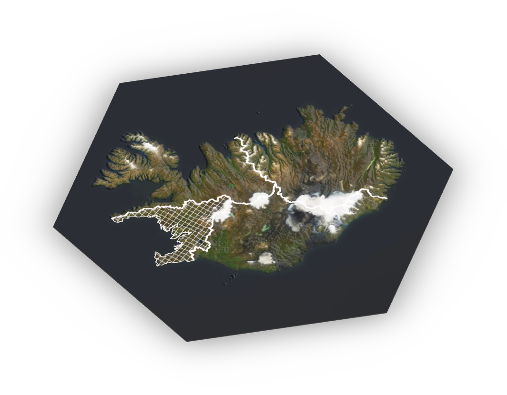

# Farvegir örplasts

Rennandi vatn er helsti farvegur örplasts á landi til sjávar [@unice2019characterizing1] hvort sem það rennur eftir ám og lækjum eða niður ræsi og með skólpi. Aðrar farleiðir örplasts eru taldar upp í töflu \@ref(tab:fartafla). Margar gerðir örplasts flytjast að einhverju leyti með fleiri farvegum en einum en þrátt fyrir það eru ákveðnar uppsprettur örplasts einkennandi fyrir hvern farveg. Hér er því sett fram samantekt á því hvaða uppsprettur örplasts eru einkennandi fyrir hvern farveg, einkum þegar litið er til hlutfalls af heildarlosun hverrar uppsprettu. Þetta er því ekki tæmandi listi en er engu að síður hagnýt samantekt fyrir kortlagningu örplastmengunar innan einstakra vatnasvæða á Íslandi.

Mesta magn örplasts sem fundist hefur hingað til í sjávarbotnsseti var rétt vestur af Svalbarða á 2,5 til 5,5 km dýpi [@Bergmann2017]. Útilokað er að sú mengun sé staðbundin og sýnir fram á að örplast berst með hafstraumum á fjarlæg hafsvæði. Örplast getur því einnig borist inn á íslenskt hafsvæði með hafstraumum. Til dæmis með flæði Atlantshafssjávar úr suðri en það flæði er árstíðabundið og mismikið milli ára [@Strait2005a] líkt og á við um hafstrauma sem fara í kringum Ísland og geta borið örplast frá helstu uppsprettum á suð- vesturhorni landsins, réttsælis með landinu norður fyrir Vestfirði [@Astthorsson1994] á svæði þar sem mengun er ekki eins mikil frá landi vegna fámennari byggða. 


```{r fartafla, fig.cap='*Vegryk á við um hjólbarða og vegmerkingar', echo=FALSE, message=FALSE, warning=FALSE}
library(knitr)
library(kableExtra)

collapse_rows_dt <-
  data.frame(
    A = c(rep('Rennandi vatn', 11),'Andrúmsloft',rep('Hafið', 3),rep('Annað', 3)),
    B = c(rep('Fráveita: skólp og ofanvatn', 8),rep('Ár, lækir og skurðir',3),'Vindur',rep('Hafstraumar/sjávarföll', 3),'Sigvatn','Landgræðsla','Snjómokstur'),
    C = c(c('Fatnaður','Snyrtivörur','Plastframleiðsla','Gervigrasvellir','Leiksvæði','Skósólar'),
        c('Vegryk*','Málning','Heyrúlluplast','Haglaskot','Plastrusl'),
          'Vegryk*',
        c('Veiðarfæri', 'Búnaður í sjókvíaeldi', 'Plastrusl í hafinu'),
        'Örplast frá urðunarstöðum',
        'Áburður úr seyru',
        'Vegryk*'))

colnames(collapse_rows_dt) <- c('Gerð farvegs', 'Farvegur', 'Uppsprettur í farvegi')

if (knitr::is_html_output()) {
kable(collapse_rows_dt, align = "c") %>%
  kable_styling("striped",full_width = F) %>%
  column_spec(1, bold = T) %>%
  collapse_rows(columns = 1:2, valign = "middle")
} else {
  kable(collapse_rows_dt, align = "c", booktabs=T, "latex")
}
```

Á landi berst örplast með vatni, vindi og með athöfnum manna. Helsta uppspretta örplasts sem dreifist með vindi er slit hjólbarða bifreiða sem sest við vegi [@Cadle1978]. Dreifing örplasts getur einnig gerst með notkun seyru til landgræðslu en algengt er að hún innihaldi örplast úr snyrtivörum [@zitko1991another] og plastúrgangi sem berst í skólphreinsistöðvar og rotþrær. Það sama getur gilt um jarðbæti unninn úr úrgangi sem inniheldur plast, einkum ef ekki er gert ráð fyrir hreinsun örplasts í míkró- og nanóstærð.

```{r vatnasvidsv, fig.cap='Fjögur megin vatnasvæði Íslands. Skálínurnar liggja yfir vatnasvæði nr. 104 á suðvesturhorni landsins', out.width='100%', fig.align='center', echo=FALSE}

```

Þegar losun örplasts á Íslandi er skoðuð er rétt að taka suðvestur horn landsins út fyrir sviga. Þar sem helsta farleið örplasts er með rennandi vatni er hér notast við skiptingu íslenska vatnaumdæmisins í fjögur meginvatnasvæði [@Bj2012]. Á suðvesturhorni landsins er vatnasvæði sem rennur í Faxaflóa (sjá mynd \@ref(fig:vatnasvidsv)). Á því svæði býr um 3/4 landsmanna ^[http://px.hagstofa.is/pxis/pxweb/is/Ibuar/Ibuar__mannfjoldi__2_byggdir__Byggdakjarnar/MAN03106.px/table/tableViewLayout1/?rxid=830c3a84-47bf-4090-8227-4c683a2f2770] og þar er summa [árdagsumferðar](http://www.vegagerdin.is/upplysingar-og-utgafa/umferdin/adferdarfraedi-talninga/) rúmir 3/4 hlutar á landsvísu. Flatarmál bygginga þar er yfir 50% flatarmáls allra bygginga á landsvísu [@OpenStreetMap] en flatarmál málaðra flata eflaust enn meiri vegna byggingarhæðar. Flestir landsmenn fara til Reykjavíkur reglulega til að sækja þjónustu sem þar er í boði, nær allar vöruflutningar eru um svæðið og nærri allt millilandaflug. Þrír stórir slippir af fjórum eru á Höfuðborgarsvæðinu og í Grindavík. Það er því rík ástæða til að skoða þetta svæði betur.

### Skólp og ræsi {-}

Fæst bæjarfélög á Íslandi hreinsa skólp að nokkru leyti \@ref(fig:skolp) en þar sem skólphreinsistöðvar eru á höfuðborgarsvæðinu fer skólp frá flestum landsmönnum  í gegnum hreinsun og hefur því hlutfall þeirra sem búa á svæðum þar sem skólp er hreinsað margfaldast á síðustu áratugum [@Þorðarson2012].

```{r skolphreins, eval=FALSE, fig.align='center', fig.cap='Skólphreinsun í þéttbýli 2010 flokkað eftir svæðum.', include=FALSE, out.width='100%'}
knitr::include_graphics("myndir/skolphreinsun_Island.png")
### ..mynd ekki höfð með
```

```{r include=FALSE}
library(BiocStyle)
```

```{r skolp, echo=FALSE, fig.align='center', fig.cap='Tegund skólphreinsunar skipt eftir fjórum flokkum náttúrulegra yfirborðsvatnshlota. Unnið upp úr samantekt á stöðu skólpmála á Íslandi árið 2014 [@Umhverfisstofnun2017].', message=FALSE, warning=FALSE, dev=switch(output(), html = "svg", latex = "pdf"), dev.args=list(bg="transparent"), out.width='100%'}

par(mar=c(4,4,4,2))

roundUpNice <- function(x, nice=c(1,2,4,5,6,8,10)) {
  if(length(x) != 1) stop("'x' must be of length 1")
  10^floor(log10(x)) * nice[[which(x <= 10^floor(log10(x)) * nice)[[1]]]]
} # https://stackoverflow.com/questions/6461209/how-to-round-up-to-the-nearest-10-or-100-or-x

skólptölur <- read.csv("skjol/skolp_urban.csv", sep="\t",encoding = "UTF-8")
skólptölur <- skólptölur[!is.na(skólptölur$Magn.skólps..pe..)& skólptölur$Magn.skólps..pe..>0,]
levels(skólptölur$Tegund.hreinsunar) <- c("Eins þreps","Ekki vitað","Engin","Ítarleg","Ítarleg","Ítarleg","Rotþrær","Tveggja þrepa","Tveggja þrepa") #Hreinsa gögnin
require(plyr)
svaedi <- ddply(skólptölur,.(Svæði,Tegund.hreinsunar),summarise,Magn=sum(Magn.skólps..pe..),.drop=F)
skólp_fylki <- matrix(svaedi$Magn,nrow = length(levels(as.factor(svaedi$Tegund.hreinsunar))),ncol = length(unique(svaedi$Svæði)),dimnames=list(levels(as.factor(svaedi$Tegund.hreinsunar)),levels(svaedi$Svæði)))

landshlutar <- c('(NV)','(NA)','(SA)','(SV)')
colnames(skólp_fylki) <- paste(unique(svaedi$Svæði),landshlutar,sep="\n")

litir <- c('#7ECEF0','white','#CB5600', '#7F7CAF','#28587B','seashell')
bp <- barplot(skólp_fylki,ylab='',xlab='',axes=F,beside=TRUE,ylim=c(0,max(skólp_fylki)*1.1))
abline(h=seq(0,roundUpNice(1.1*max(skólp_fylki)),roundUpNice(1.1*max(skólp_fylki))/5), col = 'lightgray', lty = 3)
barplot(skólp_fylki, main='Tegund skólphreinsunar', ylab="Magn (þúsundir pe.)", beside=TRUE, axes = F, col=litir ,ylim = c(0,max(skólp_fylki)*1.1),add=T);box()
axis(2,seq(0,roundUpNice(1.1*max(skólp_fylki)),roundUpNice(1.1*max(skólp_fylki))/5),labels = seq(0,roundUpNice(1.1*max(skólp_fylki))/1000,roundUpNice(1.1*max(skólp_fylki))/5000),las=2)
legend('topleft', levels(as.factor(svaedi$Tegund.hreinsunar)), fill=litir)
```

Skólphreinsun í Reykjavík er svokölluð fyrsta stigs hreinsun ^[„Hreinsunin uppfyllir að öllum líkindum ekki þær kröfur sem gerðar eru til eins þreps hreinsunar í reglugerð um fráveitur og skólp“ [@Umhverfisstofnun2017]], þar sem efni á föstu formi eru aðskilin vatni með botnfellingu, fleytingu eða notkun rista. Þær eru í blönduðu kerfi sem tekur á móti skólpi ásamt ofanvatni og með yfirfalli þegar álag er mest. Ekki er áhersla lögð á að halda eftir örrusli í þeim skólphreinsistöðvum og hlutfall örplasts sem berst inn í skólphreinsistöðvarnar er ekki mjög frábrugðið því sem mælist í útfalli þeirra [@magnusson2016microlitter]. Yfir 90% skólps á Íslandi er losað í sjó eftir aðeins fyrsta stigs hreinsun (grófhreinsun án fellingar eða síunar öragna). Annað skólp er losað í ár og stöðuvötn og árósa. Sum bæjarfélög hafa sett upp tveggja þrepa hreinsun og flest heimili í dreifbýli eru með rotþrær þar sem eftir verður seyra (um 800 tonn árlega). Mest af seyrunni er urðað og lítið brot notað í landbúnað [@Umhverfisstofnun2017].

Samkvæmt rannsókn á skólpi frá Reykjavík og Hafnarfirði [@magnusson2016microlitter] var innfallsvatn til skólphreinsistöðva á í Reykjavík með færri agnir af örplasti á rúmmál vatns miðað við stöðvar í Svíþjóð og Finnlandi sem nam heilli stærðargráðu (10 og 100 sinnum minna). Hugsanlega var það vegna mikils regnvatns sem blandast innfallsvatninu (munnleg heimild Hrönn Jörundsdóttir) og mikils affallsvatns frá heimilum en vatnsnotkun íslenskra heimila er hugsanlega meiri að jafnaði [@Pakula2010] og þéttleiki örplastagnanna því minni á rúmmálseiningu.

Í mati á losun vegna bílaumferðar var ekki gert ráð fyrir áhrifum götusópunar né þeim settjörnum sem eru við Vesturlandsveg austan Elliðaár í Reykjavík. Öllu uppsópi í Reykjavík (og kannski fleiri sveitarfélögum) er safnað saman og er það vegið áður en það er urðað svo einfalt er að nálgast það til að taka sýni. Þau sýni má senda erlendis til að mæla magn dekkjaagna á leifa af vegmerkingum í því. Einnig má taka botngreiparsýni úr settjörnum í Reykjavík til að kanna uppsöfnun dekkjaagna í setinu en það hefur ekki verið gert hérlendis.


