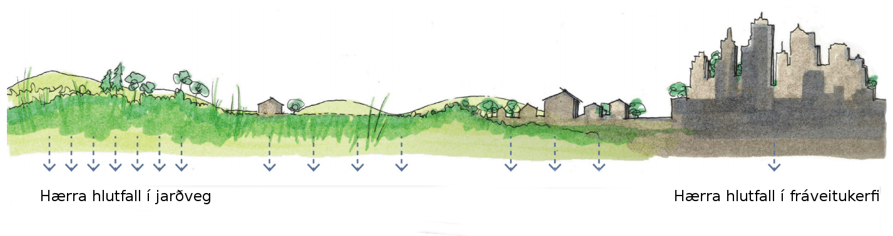
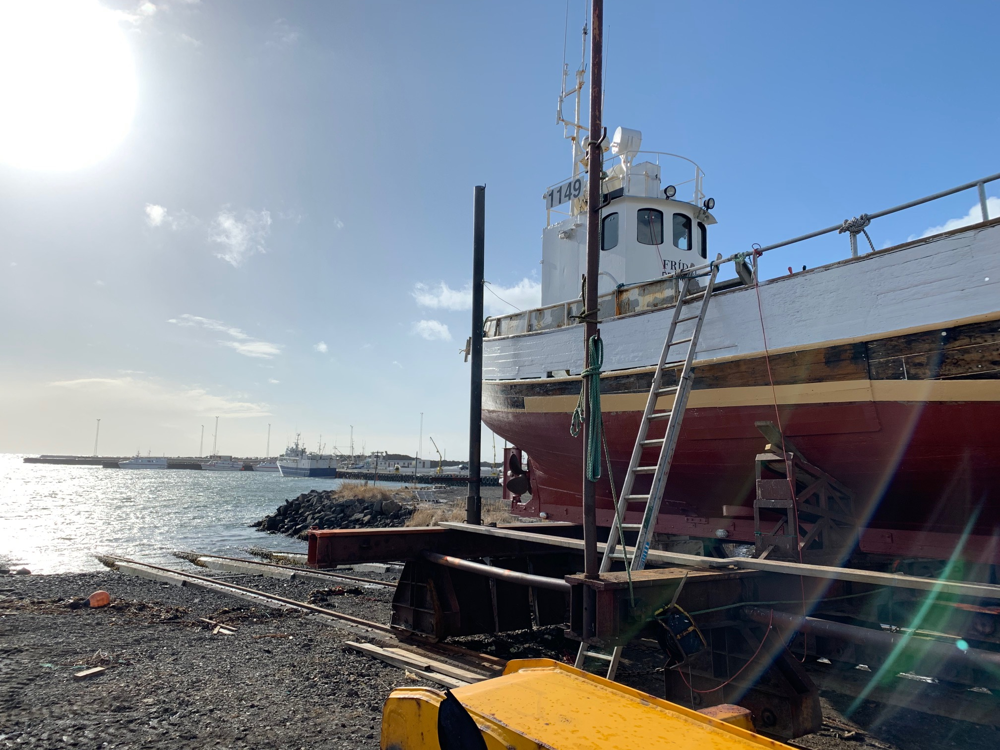

# Helstu uppsprettur örplasts á Íslandi

```{r include=FALSE}
library(BiocStyle)
```

Uppsprettur örplasts á Íslandi eru metnar á misjafnan hátt eftir því hvort gögn eru til staðar eða ekki. Þar sem þau eru ekki til eða óaðgengileg er notast við mat frá öðrum löndum og umreiknað eftir stærð og aðstæðum hérlendis. Samkvæmt fyrirliggjandi gögnum og neðangreindum matsaðferðum er árleg losun örplasts í umhverfið á Íslandi í kringum 450-1000 tonn. Uppsprettum er hér skipt í fimm flokka:

	1. Samgöngur, byggingar og iðnaður
2. Útisvæði
3. Neysluvörur
4. Matvælaframleiðsla
5. Umhverfi


```{r echo=FALSE, message=TRUE, warning=TRUE, cache=TRUE, fig.cap='Helstu uppsprettur örplasts á Íslandi og skipting í haf eða í jarðveg. Byggt á lægra mati.', fig.align='center'}

# libs <- c("rgdal", "maptools", "gridExtra","tmap","tmaptools","sp")
# lapply(libs, require, character.only = TRUE)
# 
# malbik <- rgdal::readOGR("C:/Users/BioPol VS/Documents/Vinnumappa/GIS/IS50V_SAMGONGUR_17062016_ISN2004/IS50V_SAMGONGUR_SHP/vegir1og5.shp",require_geomType = "wkbLineString")
# byggd <- rgdal::readOGR("C:/Users/BioPol VS/Documents/Vinnumappa/GIS/IS50V_MANNVIRKI_17062016_ISN2004/IS50V_MANNVIRKI_SHP/is50v_mannvirki_flakar_17062016.shp")
# clp1 <- raster::intersect(malbik,byggd)
# sum(as.numeric(as.character(clp1@data$lengd)))/sum(as.numeric(as.character(malbik@data$lengd))) #Hlutfall lengdar malbiks innan þéttbýlis = 36%


#losun <- (l+h)/2 #Meðaltal lægra og hærra mats á losun.
value <- c(379, 41, 18.2+11.8+3.2, 3, 8.2, 0.34) #Uppspretta lægra mat
losun <- c(164, 5.7, 12+3.2, 0.3, 8.2, 0.34) #losun lægra mat
#value <- c(379,586,38,233,21,48,3,11,8,32,0.3,3)
heiti <-c('Dekkjaslit','Vegmerkingar','Húsamálning','Gervigras','Þvottur','Snyrtivörur')
land <- value-losun
df <- data.frame(heiti,land,losun)
df <- df[order(df$heiti),]

library(networkD3)
nodes <- c(levels(df$heiti), 'Land ','Haf ')
nodes <- as.data.frame(nodes)
names(nodes) <- "name"

a <- list()
for (i in 1:nrow(df)) {
  a[i] <- list(rbind(matrix(c(df[i,c(2,3)]))))
}
b <- do.call(c,a)
value <- unlist(b)

links <- 
  data.frame(
    source=c(0,0,1,1,2,2,3,3,4,4,5,5),
    target=c(6,7,6,7,6,7,6,7,6,7,6,7),
    value=value)


Sank <- list(nodes, links)
names(Sank) <- c('nodes', 'links')
sn <- sankeyNetwork(
  Links = Sank$links,
  Nodes = Sank$nodes,
  Source = "source",
  Target = "target",
  Value = "value",
  NodeID = "name",
  units = "tonn",
  colourScale = JS("d3.scaleOrdinal(d3.schemeCategory20);"),
  fontSize = 12,
  nodeWidth = 30
)
if (knitr::is_html_output()) {
  htmlwidgets::onRender(sn, 'document.getElementsByTagName("svg")[0].setAttribute("viewBox", "")') #Svo að þetta sé ekki ofursmátt í Firefox
} else{
  B <- paste(nodes$name,c(df$land+df$losun,sum(df$land),sum(df$losun)), sep="- ")
  nodes <- paste(B,"t")
  nodes <- as.data.frame(nodes)
  names(nodes) <- "name"
  
  Sank <- list(nodes,links)
  names(Sank) <- c('nodes','links')
  
  sn <- sankeyNetwork(
    Links = Sank$links,
    Nodes = Sank$nodes,
    Source = "source",
    Target = "target",
    Value = "value",
    NodeID = "name",
    units = "tonn",
    colourScale = JS("d3.scaleOrdinal(d3.schemeCategory20);"),
    fontSize = 12,
    nodeWidth = 30)
  
  sn
}

```


## Samgöngur, byggingar og iðnaður {-}

Stærstu uppsprettur örplasts á Íslandi eru frá umferð um malbikaða vegi. Hjólbarðar og vegamálning innihalda plast sem verður að örplasti við slit [@kreider2010physical] en óvissa um afdrif þeirra er umtalsverð. Umferðarþungi hefur aukist síðasta áratuginn á Íslandi (yfir 20% í Reykjavík og um 30% á þjóðvegum \@ref(fig:umferdvisitala1)). Umferð á Íslandi fer að langmestu leyti um malbikaða vegi í þéttbýli og eftir þjóðvegum landsins. Farleiðir dekkjaagna (dekkja- og vegaagna) af vegum til sjávar eru annars vegar með vindum og hins vegar með ofanvatni^[„Uppbygging byggðar hefur þau áhrif að ógegndræpt yfirborð lands eykst, og vatn sem áður átti greiða leið ofan í jarðveg safnast saman á yfirborði ef ekkert er að gert. Úrkomuvatn sem fellur af húsþökum, götum, gangstéttum, bílastæðum og öðru þéttu yfirborði niður í fráveitukerfi er oft kallað „ofanvatn“. Hefðbundnar lausnir fela jafnan í sér að safna ofanvatni í fráveitukerfi sem er neðanjarðar, og leiða það þannig í pípum útaf svæðinu, oftast alla leið til sjávar.“ [@StefanFreyr]]. 

Umferðarþungi hefur aukist síðasta áratuginn á Íslandi ([yfir 30% í Reykjavík og um 45% á þjóðvegum](http://www.vegagerdin.is/upplysingar-og-utgafa/umferdin/tolfrumferdar/) sjá \@ref(fig:umferdvisitala1)). Slit á hjólbörðum er ein af stærstu einstöku uppsprettum örplasts í heiminum [@lassen2015microplastics; @essel2015sources; @sundt2014sources]. Frá því eftir miðbik síðustu aldar hafa stöðugar tækniframfarir verið drifnar áfram af pólitískum aðgerðum til að minnka mengun frá útblæstri bíla [@lee2007innovation] en í seinni tíð hefur kastljósið í meira mæli beinst að mengun ótengdri útblæstri. Dekkjaagnir eru mikilvægur hluti af þeirri mengun þar sem milli 20% og 50% gúmmís í dekkjum farþegabíla fellur til á formi svifryks ^[Svifryk er venjulega skilgreint sem agnir smærri en 10 $\mu$m (PM~10~) en agnir minni en 10 μm í þvermál eru mögulega líffræðilega virkar þar sem þær komast ofan í lungun hjá fólki [@heyder1986deposition]. Dekkjaagnir eru að jafnaði lítill hluti af svifryki frá vegum en þær hafa mælst frá 3% til 7% af rúmmáli í fínu svifryki (PM~2,5~) og allt að 10% í grófara svifryki (PM~10~) [@grigoratos2014non]. Þó ber að nefna að í íslenskri rannsókn fundust ekki dekkjaagnir í svifryki í Reykjavík [@Efla2015]. Aðstæður í Reykjavík eru sérstakar miðað við þá staði þar sem framkvæmdar eru þær rannsóknir á svifryki sem hér er vísað í. Í Reykjavík er meðalhiti lágur og mikill fjöldi rigningardaga en blautir vegir og lágt hitastig verja dekk sliti [@le1998evaluation].] og stærri agna þegar hjólbarðarnir eyðast við akstur [@atech2001national]. Dekkjaagnir eru að mestum hluta stærri en svifryk [@kreider2010physical] og setjast í kringum vegina [@Cadle1978] og í malbikið sjálft en malbik er misgljúpt eftir notkun [@Verschoor2016]. Uppsöfnun er þó takmörkuð þar sem vind hreyfir mikið og úrkoma skolar vegryki burtu með affallsvatni. Dekkjaagnir sem falla til geta brotnað niður að hluta við núninginn við vegina þegar þær losna frá dekkjunum sem veikir mótstöðu þeirra gagnvart útfjólubláu ljósi og færir þær nær niðurbroti í umhverfinu [@kreider2010physical; @Cadle1978].

```{r umferdvisitala1, echo=FALSE, fig.align="center", fig.cap="Vísitala umferðar (línur) ásamt meðalumferðarþunga yfir árið (stöplar) í þremur völdum sniðum innan höfuðborgarsvæðisins og á 16 lykilteljurum á hringveginum.", message=FALSE, warning=FALSE, dev=switch(output(), html = "svg", latex = "pdf"), dev.args=list(bg="transparent")}

roundUpNice <- function(x, nice=c(1,2,4,5,6,8,10)) {
  if(length(x) != 1) stop("'x' must be of length 1")
  10^floor(log10(x)) * nice[[which(x <= 10^floor(log10(x)) * nice)[[1]]]]
} # https://stackoverflow.com/questions/6461209/how-to-round-up-to-the-nearest-10-or-100-or-x


litura="#cb5600"
liturb="#0698d3"

rvk <- c(134529,140215,150318,162347,166900)
lndsb <- c(59959,63580,72650,79920,83575)
nicebil <- seq(0,roundUpNice(max(rvk)),roundUpNice(max(rvk))/8)
xas <- seq(2005,2018,1)
rass <- matrix(data = c(0,0,0,0,0,0,0,0,0,rvk,0,0,0,0,0,0,0,0,0,lndsb),nrow = 2,byrow = T,dimnames = list(c("Rvk","Lndsb"),xas))


par(mar = c(5,5,2,5))
bp <- barplot(1.5:14.5,rass+10000, col = NA, border = NA,axes = F)
par(new=TRUE)
barplot(rass,beside = T,axes = F,col = c(liturb,litura), border = NA, axisnames = F, ylim = c(0, max(rvk) * 1.1))
axis(4,nicebil,labels = nicebil/1000,las=2)
mtext("Meðalumferð á dag yfir árið",side=4,line = 3)
par(new=TRUE)

hofb <- c(100.00,103.90,113.31,114.30,111.61,110.06,107.63,109.18,112.26,115.61,120.50,129.18,139.52,143.55)
hring <- c(100.00, 105.86, 113.00, 110.85, 111.71, 109.12, 103.36, 103.05, 106.58, 112.34, 118.94, 135.91, 149.51, 155.93)

plot(xas,hring,type='n',font=2,ylab='Vísitala umferðar (árið 2005 = 100)',xlab='')
lines(xas,hring,type = 'o',col=litura,pch=16)
lines(xas,hofb,type = 'o',col=liturb,pch=17)

legend('topleft', c('Hringvegur','Höfuðborgarsvæðið'),lty = 'solid',col=c(litura,liturb),pch=c(16,17))

```

Íslenskir vegir eru byggðir á fyllingu með gljúpum jarðvegi og greiðri afvötnun [@Matinupa2012Summary] en þar sem plast er ekki vatnsleysanlegt gerum við ráð fyrir að það síist burtu út í jarðveginn frekar en að ferðast með grunnvatni [@ECHA2016]. Ofanvatn rennur að mestu út í jarðveginn við vegina en í þéttbýli rennur það einnig í ræsi í eða í læki og ár. Á strjálbýlli svæðum taka vegrásir og skurðir við ofanvatni. Hérlendar byggðir eru flestar við ströndina og helstu vegir milli bæja liggja eftir strandlengjunni og er því ekki löng leið milli helstu vega og sjávar. Þær agnir sem ofanvatnið ber með sér festast því síður í jarðvegi og ferskvatnsseti við slíkar aðstæður en aukin fjarlægð eykur líkurnar á viðloðun í jarðvegi eða botnfellingu [@BESSELING2017540].

Það fer í stórum dráttum eftir þéttni byggðar hversu háu hlutfalli ofanvatns er veitt í hafið með fráveitukerfum eða hve mikið seytlar niður í jarðveginn (sjá mynd \@ref(fig:ALTA))). Þar sem íslenskt þéttbýli er heldur í dreifðara lagi þá er hér reiknað með eftirfarandi:
	  
- Á þjóðvegum og sveitavegum fari 90% af affallsvatni vega í jarðveginn og 10% í yfirborðsvatn; skurði, ár og læki [@Verschoor2016]
- Í þéttbýli hérlendis fari 40% af affallsvatni vega í jarðveginn en 60% í ræsi. [@Verschoor2016]
	  

```{r ALTA, fig.cap='Myndin sýnir í stórum dráttum hlutfall ofanvatns sem rennur í jarðveg á móti hlutfalli ofanvatns sem rennur í hefðbundið fráveitukerfi miðað við þéttleika byggðar. Mynd fengin frá Alta (2016)', out.width='100%', fig.align='center', echo=FALSE}

```

Við metum það sem svo að affallsvatn sem lendir í fráveitukerfum beri allar dekkjaagnir sem það inniheldur út í haf en það affallsvatn sem rennur í jarðveg losni við allar dekkjaagnir í jarðveginn. Það skal þó tekið fram að aðstæður eru mjög ólíkar á mismunandi svæðum landsins bæði m.t.t. jarðvegsgerðar og einnig eiginleika þéttbýla og þar stendur Reykjavík út úr. Mælingar á dekkjaögnum í affallsvatni eru erfiðar í framkvæmd og gögn skortir. Nokkur líkön hafa verið gerð til að áætla magn örplasts í framburði stórra áa í Evrópu en þau eru sum hver í mótsögn hvor við aðra [@unice2019characterizing1]. Þau eiga það þó sameiginlegt að áætla örplast frá dekkjum heilli stærðargráðu lægra en í þessari skýrslu þar sem þau lýsa aðstæðum sem eru gjörólíkar íslenskum aðstæðum t.d. er fjarlægð helstu uppspretta örplsts (borgir) í tugum til hundruða kílómetra fjarlægð frá árósum.


### Hjólbarðar bifreiða {-}

Hjólbarðar eyðast smám saman við akstur vegna núnings við vegi. Margir þættir hafa áhrif á slit hjólbarða en það er mismikið eftir gerð dekkja, stærð bíla og aksturslagi [@panko2018review]. Þar sem fleiri beygjur eru á vegum og hröðunarbreytingar eru tíðari verður meira álag á dekkin og slit á þeim verður meira. Því er eyðing dekkja minni á þjóðvegum en vegum í þéttbýli [@luhana2004measurement; @Kwak2013].

Hjólbarðar eru samsettir úr flókinni blöndu efna sem er blandað með ólíkum hætti eftir þörfum. Slit er misjafnt eftir því fyrir hvaða gerð farartækja dekkin eru framleidd og hvernig slitlag vegarins er [@grigoratos2014non]. Gúmmísólar venjulegra bíldekkja eru gerðir úr blöndu af gervigúmmíi (aðallega stýren bútadíen gúmmí og bútadíen gúmmí), náttúrulegu gúmmíi, kinroki (e. carbon black) og ýmsum íblöndunarefnum [@Evans2006]. Hlutfall plastfjölliða í slitlagi hjólbarða er á bilinu 40-60% [@Redondo-hasselerharm2018; @ahlbom1994nya; @barbin1994science] (tekið saman af [@Wik2009]). Dekkjaagnirnar sem myndast við akstur blandast öðrum ögnum sem eru í malbikinu og vegrykinu sem breytir efnasamsetningu agnanna [@kreider2010physical]. Þessi blanda dekkja- og vegslits (e. tyre and road wear particles - TRWP) getur því til viðbótar innihaldið efni á borð við bik, þ.e. úr malbiki [@fauser2002tire], og ryk frá bremsuborðum/diskum [@kwak2013characterization]. Í þessari skýrslu er litið á gúmmíblönduna, ásamt öðrum bætiefnum sem er er blandað saman í slitlagi hjólbarða, sem eina heild óháð fjölliðuinnihaldi.

Ein leið til að áætla magn dekkjaslits er að miða við staðlaðar losunartölur mg/km ólíkra þyngdarflokka ökutækja. Samkvæmt Klein (2017)[-@klein2017methods] er slit hjólbarða fólksbifreiða 85-132 milligrömm fyrir hvern ekinn kílómetra, hópbifreiða 267-415 mg/km, sendibifreiða 102-159 mg/km og vörubifreiða 546-850 mg/km.

Í töflu \@ref(tab:akstur) má sjá fjölda bifreiða af mismunandi gerðum í umferð á Íslandi (þann 14. ágúst 2018) og meðalakstur samkvæmt upplýsingum frá Samgöngu- og sveitarstjórnaráðuneytinu. Séu þessar tölur margfaldað með áætluðu dekkjasliti fyrir viðkomandi ökutækjaflokka *i* er áætlað dekkjaslit er reiknað á eftirfarandi hátt: Losun~i~ = (fjöldi × meðalakstur × mg/km)~i~. Niðurstaðan er þá að árið 2017 hafi slit frá fólksbifreiðum verið 244-378 tonn, sendibifreiðum 34-52 tonn, hópbifreiðum 22-34 tonn, og vörubifreiðum 79-122 tonn.

Farleiðir dekkjaslits er að langmestu leiti með affallsvatni vega [@Verschoor2016] og eru vindbornar agnir svotil utanskildar í þessari skýrslu. Losun örplasts vegna dekkjaslits er áætlað. Við metum það sem svo að:

  - um þriðjungur allrar umferðar sé á hringvegi þar sem hverfandi magn dekkjaslits berst til hafs.
- um 2/3 hlutar allrar umferðar sé í þéttbýli þar sem hátt hlutfall dekkjaslits berst til hafs eða um 60% í gegnum ræsi. 


Áætluð heildarlosun örplasts í hafið frá sliti bifreiðahjólbarða á Íslandi er **164-255** tonn.


```{r akstur, echo=FALSE, cache = TRUE}
library(RColorBrewer)
options(OutDec = ",")
# Heildarþyngd ökutækis: Þyngd ökutækis eða vagnlestar með ökumanni, farþegum, farmi og viðfestum vinnutækjum.


bifreidar <- matrix(c(227409,23159,2410,8078,2049,2661,9746,17181,12601,14251.6,33693.6,17832,85,102,267,546,132,159,415,850),5,4,byrow = T)

slit_lagt <- bifreidar[1,]*bifreidar[3,]*bifreidar[4,]/1000000000 #Fjöldi*meðalakstur*(slit (mg/ári) lægri talan)
losun_lagt <- c()
  for (i in 1:length(slit_lagt)) {
  losun_lagt[i] <- (2/3)*slit_lagt[i]*0.6+(1/3)*slit_lagt[i]*0 #Verschoor2016
}
slit_lagt <- round(slit_lagt,0)
losun_lagt <- round(losun_lagt,0)

slit_hatt <- bifreidar[1,]*bifreidar[3,]*bifreidar[5,]/1000000000 #Fjöldi*meðalakstur*(slit (mg/ári) hærri talan)
losun_hatt <- c()
for (i in 1:length(slit_hatt)) {
  losun_hatt[i] <- (2/3)*slit_hatt[i]*0.6+(1/3)*slit_hatt[i]*0 #Verschoor2016
}
slit_hatt <- round(slit_hatt,0)
losun_hatt <- round(losun_hatt,0)

slit_ari <- ifelse(slit_hatt>slit_lagt,paste(slit_lagt,slit_hatt,sep = "-"),paste(slit_hatt,slit_lagt,sep = "-"))
losun_ari <- ifelse(losun_hatt>losun_lagt,paste(losun_lagt,losun_hatt,sep = "-"),paste(losun_hatt,losun_lagt,sep = "-"))

bifreidar[2,] <- round(bifreidar[2,]/1000,2)
bifreidar[3,] <- round(bifreidar[3,]/1000,2)
bifreidar <- rbind(bifreidar[1:3,],paste(bifreidar[4,],bifreidar[5,],sep="-"),slit_ari,losun_ari)

colnames(bifreidar) <- c('Fólksbifreið','Sendibifreið','Hópbifreið','Vörubifreið')
rownames(bifreidar)<- c("Fjöldi","Meðalþyngd (t)","Meðalakstur (þús. km/ár)","Slit (mg/km) [@klein2017methods]", "Slit (t/ár)", "Losun í hafið (t/ár) [@Verschoor2016]")


#bifreidar <- rbind(icon[c(1,2,3,4)],bifreidar)
bifreidar <- format(bifreidar,  decimal.mark=",", big.mark=".", scientific=FALSE)

if (knitr::is_html_output()) {
   knitr::kable(bifreidar, booktabs=T, caption = "Áætluð árleg losun örplasts í hafið vegna slits á hjólbörðum bifreiða. Fjöldi bíla af mismunandi gerðum í umferð á Íslandi þann 14. ágúst 2018 og meðalakstur skv. Umferðastofu. Með meðalþyngd er átt við heildarþyngd [skv. reglugerð](https://www.reglugerd.is/reglugerdir/allar/nr/155-2007). Byggt á mati Klein (2017) [-@klein2017methods]")

} else {
  rownames(bifreidar)<- c("Fjöldi","Meðalþyngd (t)","Meðalakstur (þús. km/ár)","Slit (mg/km)", "Slit (t/ár)", "Losun í hafið (t/ár)")
 knitr::kable(bifreidar, caption = "Áætluð árleg losun örplasts í hafið vegna slits á hjólbörðum bifreiða. Fjöldi bíla af mismunandi gerðum í umferð á Íslandi þann 14. ágúst 2018 og meðalakstur skv. Umferðastofu. Með meðalþyngd er átt við heildarþyngd skv. reglugerð. Byggt á mati Klein (2017) og Verschoor (2016)",format = 'latex', booktabs=T)
   }
options(OutDec = ".")

```


```{r akstur2, echo=FALSE, message=FALSE, warning=FALSE, cache=TRUE, fig.cap='Losun örplasts frá hjólbörðum á land og í haf skv. lægra mati', fig.align='center'}

slit=c(244,34,22,79) 
losun=c(106,15,9,34)
land=slit-losun

library(networkD3)
A <- c("Fólksbifreiðar ","Sendibifreiðar ","Hópbifreiðar ","Vörubifreiðar ","Land ","Haf ")
nodes <- as.data.frame(A)
names(nodes) <- "name"
#nodes$name <-  as.character(nodes$name)
links <- data.frame(source=rep(0:3,2),target=rep(4:5, each=4),value=c(land,losun))
rass <- list(nodes,links)
names(rass) <- c('nodes','links')
sn <- sankeyNetwork(Links = rass$links, Nodes = rass$nodes, Source = "source",
              Target = "target", Value = "value", NodeID = "name",
              units = "tonn", fontSize = 12, nodeWidth = 30, iterations = 0)
if (knitr::is_html_output()){
htmlwidgets::onRender(sn, 'document.getElementsByTagName("svg")[0].setAttribute("viewBox", "")') #Svo að þetta sé ekki ofursmátt í Firefox
} else{

  B <- paste(A,c(slit,sum(land),sum(losun)),sep="- ")
  nodes <- paste(B,"t")
  nodes <- as.data.frame(nodes)
  names(nodes) <- "name"
  rass <- list(nodes,links)
  names(rass) <- c('nodes','links')
  
  sankeyNetwork(Links = rass$links, Nodes = rass$nodes, Source = "source",
              Target = "target", Value = "value", NodeID = "name",
              units = "tonn", fontSize = 12, nodeWidth = 30, iterations = 0)
}
```


### Vegmerkingar {-}

Samkvæmt upplýsingum frá Vegagerðinni er á Íslandi notast við þrenns konar vegmerkingar og innihalda þær allar plastefni: málningu, sprautuplast og vélmössun. Slitþol þeirra er mismunandi en málning þolir minnst og vélmössun mest. Málaðar vegmerkingar eru 0,2-0,3 mm að þykkt, sprautuplast 0,7-1,5 mm og vélmössun 3,0 mm.

Sprautuplastefni er mest notað til vegmerkinga en það er flutt inn til landsins á duftformi sem er brætt á staðnum við merkingar og lagt á vegina. Þegar efnið er hitað rennur það og er hægt að mála með því miðlínur vega, kantlínur, gangbrautir og fleira  en svo harðnar það fljótt. Settar eru glerperlur í blautt efnið til að fá endurskin. Hvítur litur fæst með títaníum díoxíði (TiO~2~).

Sundrun plastefna í vegmerkingum vegna útfjólublárrar geislunar hefur ekki verið rannsakað en miðað við utanhússmálningu gerum við ráð fyrir að það hún sé umtalsvert minni þar sem líftími vegmerkinga er aðeins um eitt ár.

Veðurfarsþættir á borð við úrkomu, vind og hitastigsbreytingar (einkum í kringum frostmark) valda augljóslega einhverju sliti og molnun yfirborðsmerkinga en helstu áhrifaþættirnir eru umferð ökutækja og snjótennur snjómokstursbíla. Áhrif umferðar eru háð fjölda ekinna kílómetra um vegina en vert er að gefa gaum áhrifum snjómoksturs.

Vegna skiljanlegra krafa um að vegir séu vel hreinsaðir af snjó er nokkuð algengt að snjótennur skrapi vegmerkingar af vegum og jafnvel hluta af slitlaginu sjálfu. Á þetta einkum við þegar hjólför hafa myndast og vegir eru ójafnir en aðferðir við snjómokstur geta einnig haft áhrif. Þó að almenn umferð sé helsta orsök slits vegmerkinga er giskað á að slit af völdum snjómoksturs sé mögulega allt að 15% þótt hafa beri í huga að mælingar hafa ekki verið gerðar (pers. heimild Vegagerðin). Snjómokstur hefur reynst vera mikilvægur farvegur fyrir vegmerkingar og fleiri gerðir plastefna út í hafið á svæðum þar sem snjó er ýtt út í sjó [@BaztanJ2018].

Misjafnt er eftir heimildum hvernig losun örplasts frá vegmerkingum er metið. Í norskri skýrslu [-@sundt2014sources] er talað um að allar vegmerkingar sem notaðar séu árlega reiknist með sem losun örplasts vegna slits. Í danskri skýrslu [-@lassen2015microplastics] er ekki reiknað með þeim vegmerkingum sem áætlað er að fari á nýtt malbik og að um 15-25% fari í endurlagningu en í þýskri rannsókn [@Commission2009] er talað um að um að þetta hlutfall sé 80%. Samkvæmt sérfræðingum Vegagerðarinnar er um 87% vegmerkinga hérlendis vegna slits og er því tekið með í reikninginn sem uppspretta örplasts.

Vegmerkingum á Íslandi er skipt á milli Vegagerðarinnar og sveitarfélaganna. Vegagerðin sér um þjóðvegina sem liggja um landið og í gegnum flesta þéttbýlisstaði, til dæmis liggja nokkrir vegir Vegagerðarinnar í gegnum Reykjavík og svo liggja þeir gjarnan niður á höfn í gegnum minni bæi úti á landi. Unnt er að áætla slit vegmerkinga Vegagerðarinnar út frá því magni sem bætt er á vegi hennar á landsvísu ár hvert.

Árið 2017 notaði Vegagerðin 155.000 L (1,65 g/L ≈ 250 t) af vegmálningu, 454 t af sprautuplasti og 182 t af vélmössun (sama efnið notað). Sé miðað við óstaðfestar upplýsingar frá framleiðanda er fjölliðuinnihald sprautuplastsins frá 1 til 8% en í málningunni er innihald akrýlfjölliða á bilinu 15-40% (samkvæmt öryggisleiðbeiningum frá framleiðanda).


Nauðsynlegt er að endurnýja vegmerkingar sem sjást illa en umfang þeirra er nokkuð stöðugt milli ára hjá Vegagerðinni þar flestar miðlínur á íslenskum þjóðvegum eru endurlagðar árlega sem er ólíkt því sem gerist í nálægum samanburðarlöndum. Í Bretlandi er reynt að fara eftir vissum staðli um sýnileika og ekki málað fyrr en vegmerkingar eru umtalsvert eyddar (30% í þéttbýli en 70% á þjóðvegum) [@Hann2018]. Miðað við útboðsgögn nokkurra stórra sveitarfélaga er notkun sprautuplasts um 0,6 kg á mann á ári í stærri þéttbýlum. Í minni þéttbýlum er algengt að notuð sé málning frekar en plast og í minna magni^[Á Ísafirði, Bolungarvík, Sauðárkróki, Fjallabyggð, Skagaströnd, Dalvík er málað en í Hveragerði er massað. Skv. Gauti Ívari Halldórssyni framkvæmdastjóra  [vegmerkingafyrirtækis](http://www.bilastaedamalun.is/) sem sér um vegmerkingar á þessum stöðum (nema Skagaströnd) er málað frekar en massað í flestum minni þéttbýlum]. Þar er algengt að um 0,2 kg á mann sé notað af vegamálningu sé notuð árlega. Miðað við forsendur sem tilteknar eru í töflu \@ref(tab:vegmerkingar) má áætla að á Íslandi sé árleg uppspretta örplasts vegna slits á vegmerkingum sé 41-256 t.


```{r vegmerkingar, fig.cap='Tafla', echo=FALSE, message=FALSE, warning=FALSE, cache = TRUE}
linur <- data.frame(A=c('Stærri sveitarfélög','Minni sveitarfélög',rep('Vegagerðin',2)),
                    A2=c('Sprautuplast','Málning','Sprautuplast','Málning'),
                    B=c("254.280","84.170",'',''),
                    C=c("0,6","0,2",'',''),
                    D=rep('87%',4),
                    F=c(110,15,543,218),
                    G=c('1-25','15-40','1-25','15-40'),
                    H=c('1-28','2-6','5-135','33-87'),
                    I=c('0,6-16,8','1,3-3,6','0,5-13,5','3,3-8,7'))

haus <- c('','Gerð vegmerkinga', 'Íbúafjöldi', 'Notkun', 'Notkun v/viðhalds', 'Samtals vegmerkingar','Hlutfall fjölliða','Uppspretta v/slits','Losun í haf')
names(linur) <- c('','','','kg/mann','','Tonn','%','Tonn','Tonn')
require(dplyr)
require(knitr)
require(kableExtra)

if (knitr::is_html_output()) {
  
kable(linur, caption = 'Áætluð árleg uppspretta örplasts frá vegmerkingum á Íslandi árið 2017', align = "c") %>%
  kable_styling(full_width = T) %>%
  column_spec(1, bold = T) %>%
  add_header_above(haus) %>%
  collapse_rows(columns = 1:6, valign = "middle")

 } else {
 kable(linur, caption = 'Áætluð árleg uppspretta örplasts frá vegmerkingum á Íslandi árið 2017', align = "c",format = 'latex', booktabs=T) #%>%
#   kable_styling(full_width = T) %>%
#   column_spec(1, bold = T) %>%
#   add_header_above(haus) %>%
#   collapse_rows(columns = 1:6, valign = "middle")
    }
```

Líkt og við á um dekkjaagnir berst slit frá vegmerkingum helst með vindi og ofanvatni í jarðveg eða fráveitukerfi, skurði, ár og læki. Miðað við 60% ofanvatns berist í fráveitukerfi í þéttbýli og 10% í dreifbýli má áætla að losun örplasts í hafið frá vegmerkingum sé **5,7 - 42,6**.


```{r vegmerkingar2, echo=FALSE, fig.cap="Áætluð árleg heildarlosun örplasts í hafið frá vegmerkingum á Íslandi árið 2017 er **5,7 - 42,6 t**."}
library(networkD3)
nodes <- c('Stærri sveitarfélög ','Minni sveitarfélög ','Vegagerðin ','Sprautuplast ','Vegamálning ','Uppspretta lægra mat ','Uppspretta hærra mat ','Losun í haf lægra mat','Losun í haf hærra mat')
nodes <- as.data.frame(nodes)
names(nodes) <- "name"
#nodes$name <-  as.character(nodes$name)
links <- data.frame(source=c(0,1,2,2,3,4,3,4,5,6),target=c(3,4,3,4,5,5,6,6,7,8),value=c(110,15,543,218,6,35,163,93,5.7,42.6))
rass <- list(nodes,links)
names(rass) <- c('nodes','links')
sn <- sankeyNetwork(Links = rass$links, Nodes = rass$nodes, Source = "source",
              Target = "target", Value = "value", NodeID = "name",
              units = "Tonn", fontSize = 12, nodeWidth = 30)
if (knitr::is_html_output()) {
  htmlwidgets::onRender(sn, 'document.getElementsByTagName("svg")[0].setAttribute("viewBox", "")') #Svo að þetta sé ekki ofursmátt í Firefox
} else{
   B <- paste(nodes$name,c(110,15,761,653,233,41,256,6,43),sep="- ")
  nodes <- paste(B,"t")
  nodes <- as.data.frame(nodes)
  names(nodes) <- "name"
  rass <- list(nodes,links)
  names(rass) <- c('nodes','links')
  sn <- sankeyNetwork(Links = rass$links, Nodes = rass$nodes, Source = "source",
              Target = "target", Value = "value", NodeID = "name",
              units = "Tonn", fontSize = 12, nodeWidth = 30)
  sn
}
  
```


#### Hjólbarðar flugvéla {-}


Ólíkt hjólbörðum ökutækja eru hjólbarðar flugvéla einungis notaðir við upphaf og lok ferðalags og slit þar af leiðandi hlutfallslega minna og einskorðað við flugvelli. Hér er gert ráð fyrir að hjólbarðar flugvéla séu gerðir úr gúmmíblöndu sem er ekki það frábrugðin hinum ýmsu samsetningum annarra hjólbarða að það breyti nokkru fyrir tilgang þessarar skýrslu.

Ein leið til að áætla losun örplasts frá hjólbörðum flugvéla er að margfalda fjölda flughreyfinga, þá er átt við flugtak og lendingu saman, með áætluðu dekkjasliti. Hér er gerður greinarmunur á millilandaflugi og innanlandsflugi þar sem stærri flugvélar eru alla jafna notaðar í millilandaflugi.

Dæmigerðar millilandaflugvélar eru flugvélar á borð við Boeing 757 [@kole2017wear] og Airbus 321 (pers. heimild) sem vega frá 30 til 65 tonna án farþega og eru með fjögur til átta aðalhjól og tvö framhjól. Slit hjólbarða flugvéla í hverri flughreyfingu (tekið saman af Kole [-@kole2017wear]) er metið um 21 gramm frá hverju framhjóli og 59 grömm frá hverju aðalhjóli eða 278-514 grömm í heildina. Sé áætlað dekkjaslit margfaldað með fjölda flughreyfinga í millilandaflugi á Íslandi árið 2017 (65.528 flughreyfingar) [@isavia2017] nemur það 18 til 34 tonnum af dekkjasliti árlega.

Flugvélar í innanlandsflugi á Íslandi eru flestar á bilinu 10 til 18 tonn án farþega (t.d. Bombardier Q400 (18 tonn), Bombardier Q200 (10 tonn) og  Jetstream 32 (10 tonn)). Ekki fundust tölur um slit hjólbarða hjá þessum flugvélum en sé lauslega gert ráð fyrir að slitið sé í kringum 1/3 af því sem áætlað er fyrir flugvélar í millilandaflugi. Af hinum tæpu 130 þúsund flughreyfingum hérlendis árið 2017 voru 75 þúsund þeirra snertilendingar sem reiknast sem 0,5 flughreyfing. Með sömu aðferðum og notaðar voru við að meta dekkjaslit frá millilandaflugi má áætla um 8-16 tonnum árlega vegna innanlandsflugs. Árlegt magn dekkjaslits frá hjólbörðum flugvéla er því metið 26-50 tonn. Þetta mat er byggt er á óáreiðanlegum forsendum og ekki var unnt notast við nákvæma stærðarflokkun þeirra flugvéla sem lentu og tóku á loft á Íslandi og því viðbúið að skekkja matsins sé talsverð.

Allar flugbrautir á Keflavíkurflugvelli afvatnast út í jarðveginn í kring og berst því líklega ekki í hafið í miklu mæli. Fráveitukerfi flugvallarins tekur við ofanvatni frá byggingum á vellinum. Ekki var kannað hvernig fráveitumálum er háttað við aðra flugvelli eru staðsettir við sjó eða við fljót í tilfelli Egilstaðaflugvallar. Ekki er hægt að meta losun örplasts í hafið frá flugvélahjólbörðum hérlendis að svo stöddu en uppspretta örplasts frá hjólbörðum flugvéla í umhverfið árlega er **26-50 tonn**.

```{r eval=FALSE, include=FALSE}
millilandaflughreyfingar=65528
neðri.mörk.skv.Kole=278
efri.mörk.skv.Kole=514
65528*c(278,514)

innanlandsflughreyfingar=53390
neðri.mörk.skv.Kole=278
efri.mörk.skv.Kole=514
snertilendingar=75497
(53390)*c(278/3,514/3)+(75497/2)*c(278/3,514/3)
```


## Málning {-}

*Fyrirvari: Innlend framleiðsla er ekki tekin með í reikninginn hér því ekki fengust nákvæmar upplýsingar um innflutt magn þeirra efna sem eru notuð til að blanda málningu. Hægt er að nálgast lista yfir fyrirtæki sem kaupa inn vissar vörur og grennslast betur fyrir um hvaða efni um ræðir en Tollstjóri má ekki afhenda þann lista nema með lagaheimild.*

Málnin sem er hellt niður í ræsi er aðeins solid content af örplasti en málningarflögur eru 100% örplast

### Utanhússmálning {-}

Flestar gerðir málningar eru með syntetískum fjölliðum sem bindiefni [@Durkin2018] og vitað er að málning slitnar og veðrast. Mest er innflutt af akrýl- og vínylblandaðri málningu til landsins til notkunar innanhúss og utan en bæði þessi efni eru plastefni. Utanhússmálning flagnar af og veðrast að einhverju leyti en aðallega losnar hún af við háþrýstiþvott og getur borist til hafs með fráveitukerfum og vindum. Það skal tekið fram að hluti plastefna í utanhússmálningu sundrast vegna útfjólublárrar geislunar og vatnsrofs og berst því ekki í umhverfið sem örplast. Á líftíma málningar á veggjum og þökum utanhúss brotnar allt að 67% einliða plastefnanna niður í koltvísýring, vatn og nitur [@Hann2018] og er sá hluti því dreginn frá heildarlosun örplasts frá utanhússmálningu. 

Markaðshlutur innimálningar gagnvart útimálningu er ólíkur milli rannsókna í mismunandi löndum. Í Danmörku og Svíþjóð var útimálning metin 63% af heildarmagni en aðeins 27% í Evrópusambandsríkjunum [@Hann2018]. Í norsku örplastsskýrslunni má umreikna að þar sé hlutfallið um 35% [@sundt2014sources]. Munurinn á milli norðurlandanna og Evrópusambandsríkjanna getur skýrst af því að meiri veðrun í norðlægari byggðum krefjist meiri útimálningar [@Hann2018] en ólík menning spilar einnig inn í. Á Íslandi er veðrun útimálningar einnig mikið vandamál sem rökstyður samanburð við hin Norðurlöndin en hér er bygginarstíll þó um margt ólíkur þeim.

Timburklædd hús þarf að mála oftar en steinhús. Á Íslandi er lítið um timburklædd hús en hér eru aftur á móti nánast engar ómálaðar múrsteinsbyggingar sem eru mjög algengar í Skandinavíu og víðar Evrópu. Þrátt fyrir þónokkurn fjölda steinaðra bygginga hér á landi (um 3000 byggingar um síðustu aldamót) sem ætti ekki að þurfa að mála [@Guðmundsson2003] eru flest hús máluð og ólíkt nágrannaþjóðunum mála Íslendingar næstum öll þök.

Útimálun er framkvæmd vegna nýbygginga eða slits, bæði á þökum og veggjum en innimálun er hins vegar framkvæmd við eigendaskipti og nýbyggingu. Hlutfall sölu útimálningar hjá innlendum söluaðilum er mishátt eftir því hvort viðskiptin eru við fagmenn eða heimili.
Samkvæmt tölvupósti er hlutfall útimálningar undir 30% hjá stórum söluaðila sem afgreiðir heimili að mestu en hærra hjá öðrum stórum söluaðila (yfir 60%) sem afgreiðir að mestu fagmenn.

Innflutt málning árin 2016 og 2017 var 3.15 þúsund tonn á ári [@tollur2017] eða um 9,3 kg á mann (hér er ekki tekið með efni sem notuð eru til framleiðslu á málningu hérlendis). Þetta er af sömu stærðargráðu og mat Hann [-@Hann2018] um málningarnotkun á mann í Evrópusambandsríkjunum (um 8,2 kg).

Losun örplasts frá utanhússmálningu hefur ekki verið könnuð beint og er þetta mat því aðeins byggt á fræðilegum grunni. Veðrun og slit málningar veldur losun á syntetískum fjölliðum út í umhverfið þar sem þær verða fyrir útfjólublárri geislun og geta brotnað niður að miklu leyti. Miðað við eftirfarandi forsendur má áætla örplastmengun frá útimálningu með eftirfarandi hætti:

  - frá 27-63% innfluttrar málningar séu notuð á fleti utanhúss (pers. heimildir)
- að um 20% af innihaldi málningar séu plastefni [@Hann2018]
- að 67% plastefnanna sundrist vegna veðrunar (og reiknist því ekki með) [@Hann2018]
- að um 1.6% utanhússmálningar flagni af (vegna veðrunar eða háþrýstiþvottar) sem örplast [@Hann2018]
- að um 2.5% af eftirstandandi málningu losni sem örplast vegna veðrunar [@Hann2018]

```{r malningartafla, fig.cap='Tafla',echo=FALSE, message=FALSE, warning=FALSE}
library(knitr)
library(kableExtra)
lina <- c("3150","27-63","850-2000","20","67","740-1720","1,6","11,8-27,5","2,5","18,2-41,2")
#Háþrýstiþvottur og flögnun: Hth = (3150000*c(0.27,0.63)-3150000*c(0.27,0.63)*0.2*0.67)*0.016
#Losun vegna slits: Lvs = ((3150000*c(0.27,0.63)-3150000*c(0.27,0.63)*0.2*0.67)-Hth)*0.025
lina <- as.data.frame(t(lina))
names(lina) <- c("Tonn", "%", "Tonn", "%", "%", "Tonn", "%", "Tonn", "%", "Tonn")

if (knitr::is_html_output()) {
kable(lina, caption = 'Uppspretta örplasts í umhverfið frá útimálningu á Íslandi.' , align = "c") %>%
kable_styling(c("striped", "bordered", full_width = F, position = "center")) %>%
add_header_above(
c(
"Innflutt málning",
"Hlutur utanhúss-málningar" = 2,
"Syntetískar fjölliður",
"Sundrun og Niðurbrot",
"Eftirstandandi málning",
"Háþrýsti-þvottur og flögnun" = 2,
"Uppspretta v/slits" = 2
)
)

 } else {
   lina <- c("3150","27-63","850-2000","20","67","740-1720","1,6","11,8-27,5","2,5","18,2-41,2")
lina2 <- c("Tonn", "%", "Tonn", "%", "%", "Tonn", "%", "Tonn", "%", "Tonn")
lina3 <- c("Innflutt málning","Hlutur utanhúss-málningar","","Plastefni","Sundrun","Eftirstandandi","Háþrýsti-þvottur","","Uppspretta vegna slits","")
lina <- data.frame(lina3,lina2,lina)
lina <- unname(lina)

kable(lina,align = "c",format = 'latex', caption = 'Uppspretta örplasts í umhverfið frá útimálningu á Íslandi.' , booktabs = T)

 }
```

Áætluð uppspretta örplasts frá utanhússmálningu á ári er því um 30-70 tonn. Þar sem um 70% af flatarmáli bygginga er innan þéttbýlis^[hér er þéttbýli skilgreint eftir gagnalaginu mannvirki í IS 50V kortagrunninum frá landhelgisgæslunni] er aftur farið eftir áætluðu hlutfalli ofanvatns sem rennur í ræsi (60%) [@Verschoor2016]. Byggingar utan þéttbýlis þar sem fráveita er nánast engin eru ekki hafðar með. Áætluð losun örplasts í hafið frá útimálningu er því **12-29 t**

### Innimálning {-}
Örplastmengun vegna málningar innandyra verður aðallega vegna þrifa á penslum. Sú málning berst beint í hafið um fráveitukerfi og er reiknað með að hún sé um 1,6 % [@Hann2018]. Innimálning verður ekki fyrir mikilli veðrun og hvert lag er málað yfir það sem fyrir var án þess að það sé þvegið af.


```{r innimalningartafla, fig.cap='Tafla', echo=FALSE, message=FALSE, warning=FALSE}
library(knitr)
library(kableExtra)
lina <- c("3150","37-73","1165-2300","20","230-460", "3-15","3,2-7,1")
#Losun vegna skolunar = ((3150000*c(0.37,0.73))*0.2)*c(0.85,0.97)*0.016

if (knitr::is_html_output()) {
lina <- as.data.frame(t(lina))
names(lina) <- c("Tonn", "%", "Tonn", "%","Tonn", "%", "Tonn")
kable(lina,align = "c", caption = 'Áætluð árleg losun örplasts í hafið frá innanhússmálningu á Íslandi.') %>%
  kable_styling(c("striped", "bordered", full_width = F, position = "center")) %>%
  add_header_above(
    c(
      "Innflutt málning",
      "Hlutur innanhúss-málningar" = 2,
      "Plastefni" = 2,
      "Ónýtt málning",
      "Losun vegna skolunar"
    )
  )
} else{
  lina <- c("3150","37-73","1165-2300","20","230-460", "3-15","3,2-7,1")
  lina2 <- c("Tonn", "%", "Tonn", "%","Tonn", "%", "Tonn")
  lina3 <- c("Innflutt málning","Hlutur innanhúss-málningar","","Plastefni","","Ónýtt málning","Losun vegna skolunar")
  lina <- data.frame(lina3,lina2,lina)
lina <- unname(lina)
  kable(lina,align = "c",format = 'latex', caption = 'Áætluð árleg losun örplasts í hafið frá innanhússmálningu á Íslandi.', booktabs = T)
  
}
```

Efmiðað er við að um 20% af innihaldi málningar sé syntetískar fjölliður [@Hann2018] er áætluð heildarlosun örplasts frá innimálningu á ári því **3,2-7,1** tonn.

Ekki er öll málning með plastbindiefnum því einnig eru alkýðbindiefni algeng í málningu sem eru með vatnssækna eiginleika og brotna á annan veg niður í náttúrunni. Mat á þrifum á verkfærum er byggt á lítilli þekkingu um vinnubrögð fagmanna (eru verkfæri skoluð, þeim hent). Nauðsynlegt er að gera markaðsrannsókn þar sem kannað er hve mikill hluti málningar er seldur til fagmanna og heimila. Einnig er nauðsynlegt að greinarmunur sé gerður á ólíkum bindiefnum í málningu og kannað verði til hlítar hve mikið af syntetískum fjölliðum til framleiðslu málningar er flutt inn í gegnum Tollstjóra.

```{r echo=FALSE, fig.cap="Áætluð árleg heildarlosun örplasts frá húsamálningu er 15,2-36,1 tonn", message=FALSE, warning=FALSE, fig.align='center'}
library(networkD3)
nodes <- c("Útimálning","Innimálning",'Land','Haf')
nodes <- as.data.frame(nodes)
names(nodes) <- "name"
#nodes$name <-  as.character(nodes$name)
links <- data.frame(source=c(0,0,1),target=c(2,3,3),value=c(30,12,3.2))
rass <- list(nodes,links)
names(rass) <- c('nodes','links')
sn <- sankeyNetwork(Links = rass$links, Nodes = rass$nodes, Source = "source",
              Target = "target", Value = "value", NodeID = "name",
              units = "tonn", fontSize = 12, nodeWidth = 30)
if (knitr::is_html_output()) {
  htmlwidgets::onRender(sn, 'document.getElementsByTagName("svg")[0].setAttribute("viewBox", "")') #Svo að þetta sé ekki ofursmátt í Firefox
} else{
   B <- paste(nodes$name,c(42,3.2,30,15),sep="- ")
  nodes <- paste(B,"t")
  nodes <- as.data.frame(nodes)
  names(nodes) <- "name"
  rass <- list(nodes,links)
  names(rass) <- c('nodes','links')
  sn <- sankeyNetwork(Links = rass$links, Nodes = rass$nodes, Source = "source",
              Target = "target", Value = "value", NodeID = "name",
              units = "Tonn", fontSize = 12, nodeWidth = 30)
  sn
}
```

### Skipamálning {-}

Í þessari skýrslu er sú nálgun valin að áætla magn skipamálningar út frá fjölda og stærð skipa. Skip eru með marga málaða fleti sem erfitt er að henda reiður á og því er hér aðeins stikað á stóru en til frekari einföldunar verða aðeins fiskiskip könnuð þar sem önnur skip eru mjög lítill hluti af skipaflota landsins. Ekki hefur verið framkvæmd markaðskönnun hjá söluaðilum til að meta magn skipamálningar frekar en annarrar málningar.

Fjórir stórir slippir eru á landinu, þar af þrír á SV-landi og einn á Akureyri. Minni slippir, eða dráttarbrautir sem geta tekið inn smærri báta, eru hér og þar um landið. Í slippum landsins eru nokkrir tugir skipa þjónustaðir árlega. Hver sem fær þjónustu hjá slippum getur haft sína hentisemi varðandi þykkt málningarlagsins og gerð málningar og sumir skaffa málningu sjálfir en aðrir kaupa af slippunum. Í stóru slippunum eru skip sprautumáluð en langflestir minni bátar eru málaðir með rúllum og penslum af eigendum þeirra. Þeir eru oft hífðir upp og málaðir nálægt bryggju. Mörg íslensk skip eru máluð í útlöndum og hérlendir slippir taka erlend skip á móti.

```{r Slippur, fig.cap='Skip í slipp á Skagaströnd. Nokkrar smærri dráttarbrautir eru hér og þar um landið sem þjónusta eigendur smárra til meðalstórra skipa', out.width='60%', fig.align='center', echo=FALSE}

```

Málun er tíðust á botninum undir vatnslínunni og á þann flöt er notuð sérstök málning til varnar ásætum sem annars myndu auka viðnám skipsskrokksins. Skip eru máluð um það bil einu sinni á þriggja til fimm ára fresti en botninn er gjarnan málaður annað hvert ár eða árlega. Þegar bátar eru háþrýstiþvegnir losna málningarflyksur sem geta borist í hafið. Hlutfall plastefna getur verið milli 30% og 80% (skv. tækniblöðum frá Sérefnum ehf.) og allt að 40% fellur til við háþrýstiþvott [@Verschoor2016]. Það er þó misjafnt hve mikið losnar af og samkvæmt heimildarmönnum frá slippunum sjálfum væri nærri lagi að segja að um 10% málningar sé þvegin af við háþrýstiþvott.

Íslenski skipaflotinn er að mestu leyti fiskiskip og í Skipaskrá eru upplýsingar um lengd og rúmmál skipa. Þær upplýsingar eru aðgengilegar á vef [fiskistofu](http://www.fiskistofa.is/) fyrir þau skip sem eru með gilt veiðileyfi en það voru alls 1146 skip árið 2018 og þar af 972 bátar undir 15 að lengd. Til að áætla flöt skipaflotans undir vatnslínu má notast við aðhvarfsjöfnuna: 

\begin{equation} 
  Flötur = a*Brúttótonn^b
  (\#eq:WSA)
\end{equation}

(þar sem a = 15,8 ± 0,25 og b = 0,602 ± 0,002 og R^2^ = 0.92) frá Moser (2016)[-@Moser2016] en aðhvarfsjafnan er byggð á mælingum á um 28.000 skipum. Samkvæmt jöfnunni er heildarflötur íslenskra fiskiskipa undir vatnslínu um 169.000 m^2^. Algengt er að í öryggisleiðbeiningum fyrir botnmálningu sé reiknað með um 7 m^2^/L og því má áætla að um 20.000 L af botnmálningu þurfi á skipaflotann hérlendis eða um 36 tonn miðað við lauslega áætlun á þyngd málningarinnar um 1,5 kg/L. Aðhvarfsjafnan fellur misvel að bátum eftir lögun þeirra. Hún vanáætlar t.d. botnflöt lítilla plastbáta (s.s. Sómabáta) sem eru algengir hérlendis en út frá henni má þó sjá að meirihluti botnmálningar fer almennt á stór skip þó þau séu svo fá (sjá mynd \@ref(fig:slippur)).


```{r slippur, echo=FALSE, message=FALSE, warning=FALSE, fig.show='hold',out.width = '50%', dev.args=list(bg="transparent"),fig.cap='Samband skipslengdar og botnflatar. Kökuritið sýnir hlutfall flatarmáls íslenskra fiskiskipa í þremur stærðarflokkum: Undir 15 metra löng skip, milli 15 og 30 metra löng og yfir 30 metra löng. Fengið með jöfnu frá Moser (2016)', fig.align='center' }
par(mar = c(4.6, 6, 0, 0))
Batar <- read.csv("skjol/batar.csv",fileEncoding = "UTF-8")
litlir <- Batar[Batar$Lengd<15,]
storir <- Batar[Batar$Lengd>30,]
adrir <- Batar[!rownames(Batar) %in% c(rownames(litlir),rownames(storir)),]
Batar$gerd <- ifelse(Batar$Lengd<15, "Smábátar",ifelse(Batar$Lengd>15 & Batar$Lengd<30,"Miðlungs","Stór skip"))

yLab=expression(paste("Botnflötur ( ",m^2,")"))
xLab="Lengd (m)"
plot(Batar$Lengd,(Batar$WSA),type='n', ylab = "",xlab="")
mtext(xLab,1,3,cex=2)
mtext(yLab,2,3,cex=2)
points(litlir$Lengd,(litlir$WSA),col=liturb, pch=18)
points(adrir$Lengd,(adrir$WSA),col=1)
points(storir$Lengd,(storir$WSA),col=litura, pch=19)
legend("topleft",c("Smábátar <15m. N=972","Miðlungs N=75","Stór skip >30m. N=99"),col = c(liturb,1,litura),pch = c(18,1,19),cex=2,bty='n')

# landi <- data.frame(
#   skr=c(2890,2889,2895,1868,2170,1902,2881,2882,2184),
#   L = c(54.75,54.75,54.75,56.86,64.55,55.6,80,81,66.96),
#   Breidd = c(13.5, 13.5, 13.5, 12.6, 12.8, 12.8, 17, 17, 13),
#   Brt= c(1827,1827,1827,1469.7,1845,1521,3672,3672,2160),
#   D = c(4.7, 4.7, 4.7, 7.7, 8, 8, 8.5, 8.5, 8.53)
# )
# 
# landi2 <- Batar[Batar$Skipaskrárnúmer %in% landi$skr,]
# points(landi2$Lengd,landi2$WSA,pch=13,cex=2,col=2) #Skip HBGranda

par(mar = c(0, 0, 0, 0))
require(plyr)
kaka <- ddply(Batar,.(gerd),summarise,Flatarmal=sum(WSA))
pie(kaka$Flatarmal,labels = kaka$gerd, border="grey",col = c("transparent",liturb,litura),cex=2)
```


Þar sem það eru engin neðri mörk á stærð báta sem geta farið í slipp eru mörkin óljós en hér er skipum skipt í 3 stærðarflokka: Undir 15 metra löng skip, milli 15 og 30 metra löng og yfir 30 metra löng. Litlir bátar, undir <10 metrar á lengd, eru sjaldnast settir í slipp og reiknum við því með að þeir séu að mestu leyti málaðir af eigendum uppi á landi og flyksurnar af háþrýstiþvotti á þeim fari í jarðveginn í mismikilli fjarlægð frá sjó. Stærri bátar og skip eru tekin í slipp niðri við sjó.

#### Smábátar {-}

Smábátar eru bátar undir 15 metrum að lengd. Smábátar nota um 2 til 2,5 L (eða 1-1,3 kg/L) af málningu á ári [@Verschoor2016] eða 972-1236 kg/ári. Miðað við að hlutfall plastefna geti verið milli 30% og 80% og að upp undir 40% falli til við háþrýstiþvott [@Verschoor2016] er örplastlosun í umhverfið frá smábátum undir einu tonni á ári. Þar sem smábátar eru gjarnan málaðir af eigendum uppi á landi fer hluti þessarar losunar í jarðveginn og berst því ekki í hafið.  

#### Stærri skip {-}

Séu stór skip máluð á þriggja til fimm ára fresti er ekki ólíklegt að þau losi að því sem nemur einni stærðargráðu meira af örplasti í hafið. Þá er ekki tekið með það sem fýkur burtu við sprautumálun [@OECD2009] sem getur verið umtalsvert þar sem hérlendir slippir eru ekki yfirbyggðir. Mesta mögulega losun örplasts frá slippunum er þó vegna háþrýstiþvottar

Í hollenskri rannsókn (Verschoor, 2016) [@Verschoor2016] var áætlað að 14.830 tonn af málningu færu á 1.250 skip eða um 11,8 tonn á skip. Þar var um að ræða stór skip með 4-6 metra hæð undir vatnslínu. Miðað við að hlutfall plastefna geti verið milli 30% og 80% og að 10% - 40% falli til við háþrýstiþvott [@Verschoor2016] er örplastlosunin mögulega 0,6-2,6 t af á skip. Ekki fengust tölur um fjölda og stærð skipa sem þjónustuð eru í slippum hérlendis árlega en sé tekið dæmi um stóru slippina fjóra, sem eru í Grindavík, Hafnafirði, Reykjavík og Akureyri, þá má ætla að hvert skip sé um tvær vikur í slipp. Þá eru hugsanlega um 100 stór skip á ári tekin í slipp hérlendis, íslensk og erlend. Það má því áætla að 60-260 tonn af örplasti falli til vegna stórra skipa í slipp og þá eru dráttarbrautirnar ekki meðtaldar. 

Líftími (tíminn milli þess sem skipið er málað) skipamálningar er almennt styttri en hjá húsamálningu og því er sundrun vegna veðrunar kannski ekki eins há tala. Eflaust veldur veðrun sundrun plastefna í skipamálningu að hluta en ólíklegt er að nokkur sundrun eigi sér stað undir vatnsyfirborðinu. Ekki er vitað með hvaða hraða þær málningarflyksur sem liggja í jarðvegi eftir háþrýstiþvott í slipp sundrast en samkvæmt ónefndum heimildarmönnum hjá slippunum sjálfum er nánast allt sem fellur til vegna háþrýstiþvotta hreinsað upp úr flotkvíunum en hjá slippunum með dráttarbrautir er hreinsað upp eftir hentisemi. 

Í fyrrnefndri hollenskri rannsókn [@Verschoor2016] var reiknað með því að aðeins 3% af því sem fellur til við háþrýstiþvott í slippum berist í hafið en þar í landi voru reglur hertar árið 1985 sem urðu til þess að farið var að hreinsa affallsvatn í slippum. Hérlendis er óheimilt að losa þrávirk efni í hafið og því er viðbúið að þessum úrgangi sé fargað eftir réttum leiðum. Því er áætlað að losun örplasts í hafið frá fjórum stærstu slippum hérlendis sé svipuð og áætluð hjá (Verschoor, 2016) [-@Verschoor2016] allt að 2 - 7,8 tonn.


Þar sem viðnám skipsbolsins við hafflötinn er mjög lítið er áætlað að aðeins um 1% botnmálningar losni af vegna slits, aðallega við núning við bryggju [@OECD2009]. Í tilfelli smábáta væri það mjög lág tala en fyrir þau 59 skip sem eru yfir 50 metrar á lengd og ætla má að yfir 10 tonn af málningu þurfi til að fullmála er 1% slit um 6 t á 3 - 5 ára fresti. Því er áætlað að losun örplasts í hafið vegna skipamálningar geti verið á bilinu **3,2 - 10 t á ári**.


## Frumplast í plastframleiðslu {-}

Frumplast er ekki framleitt á Íslandi en er engu að síður flutt inn í þónokkru magni til framleiðslu á hinum ýmsu plasthlutum, t.d. fiskikörum, heitum pottum og trefjaplastbátum. Í þeim löndum þar sem frumplast er framleitt, t.d. Noregi og Svíþjóð, er gert ráð fyrir að losun í umhverfið sé í kringum 0,4% [@sundt2014sources] en aðrar forsendur eiga við í löndum þar sem frumplast er eingöngu innflutt [@lassen2015microplastics].


Fyrirtæki sem stunda plastframleiðslu í Danmörku notast eingöngu við innflutt frumplast líkt og hérlendis, aðallega frá Þýskalandi. Nokkur fyrirtæki í plastframleiðslu í Danmörku sem tóku þátt í átaki til að sporna við sóun á plastefni í framleiðsluferli sínu svöruðu því til að um 0,04% af þeirra hráefni færi til spillis en aðeins litlum hluta þess væri sópað í niðurföll eða 0,0013% hið mesta og engin losun væri beint í umhverfið [@lassen2015microplastics]. Það má því áætla að hérlendis sé losun vegna frumplasts í plastframleiðslu frá 0,0005% (sem er um helmingur af þeirri tölu). Engin gögn eru tiltæk um losun plasts í frumgerðum hérlendis en viðmið OECD er að í versta falli fari um 0,01% efnisins til spillis við aðstæður þar sem lítil hætta er á sóun líkt og búast má við á Íslandi, helst er viðbúið að eitthvað efni glatist við flutning og meðhöndlun [@OECD2009].

```{r eval=FALSE, fig.cap=" Íslenskir framleiðendur móta plast eftir þörfum og selja beint til notenda.", warning=FALSE, dev.args=list(bg="transparent"), include=FALSE}
library(DiagrammeR)
library(magrittr)

litura="#cb5600"
#liturb="#0698d3"
liturb="#28c1ff"
# Create a node data frame (ndf)
ndf <- create_node_df(n = 7,
                      style="clear",
                      shape = c("circle",rep("rectangle",5),"circle"),
                      #fillcolor=liturb,
                      color= liturb,
                      fontsize=5,
                      label = c("Framleiðsla \n frumplasts, \n íblöndun og \n mótun", "Íslenskir \n framleiðendur","Notkun", "Landfylling", "Endurvinnsla","Brennsla", "Útflutningur"))

# Create an edge data frame (edf)
edf <- create_edge_df(from = c(1,2,3,3,3,3,2),
                      to = c(2,3,4,5,6,7,7),
                      color= litura)

# 1 2
# 2 3
# 3 4567
# 2 6

# Create a graph with the ndf and edf
graf <- create_graph(nodes_df = ndf,edges_df = edf) #%>%
  #add_global_graph_attrs("graph", "rankdir", "LR")


#graf %>% add_global_graph_attrs(attr = "label", value = "Landfylling", attr_type = "graph")

render_graph(graf, layout = "kk")
```

```{r eval=FALSE, fig.align='center', fig.cap=" Íslenskir framleiðendur móta plast eftir þörfum og selja beint til notenda.", warning=FALSE, dev.args=list(bg="transparent"), include=FALSE, out.width='80%'}
knitr::include_graphics("myndir/diagrammerinn.png")
```
Samkvæmt upplýsingum frá Tollstjóra fyrir árið 2017 og 2016 voru flutt inn um 12.600 tonn af plasti árlega í frumgerðum á borð við upplausnir, þeytur, deig eða önnur form (tollskrárnúmer 3901-3914). Það má því áætla að losun vegna frumplasts í plastframleiðslu sé frá 0,0005-0,01% eða **0,06 - 1,3 tonn** árlega. Þó hefur ekki verið gerð könnun á því og matið er því annars vegar byggt á tölum sem framleiðendur í Danmörku gefa upp og hins vegar mati OECD frá iðnaði sem er mjög smár hér á landi. Þetta á bæði við um leka og sóun innandyra hjá framleiðslufyrirtækjunum og í flutningum og meðhöndlun.


## Útisvæði {-}

### Gervigrasvellir {-}

Örplastmengun frá gervigrasvöllum er tvenns konar. Annars vegar vegna slits gervigrassins sjálfs og hins vegar vegna innfyllingar. Innfylling er það kallað þegar bætt er á gúmmíkurlið í gervigrasinu. Nokkrar gerðir gervigúmmís eru notaðar sem innfyllingarefni, algengast er að notað sé dekkjakurl en einnig er notast við annars konar dýrara efni. Kurlið er fínna en 5 mm og telst því til örplasts miðað við tilgang þessarar skýrslu. Viss hluti þess dreifist í kringum vellina með vindi, undir skóm og í fatnaði og einnig með snjómokstri eða skolast burtu með affallsvatni [@Wredh2014].


Allt að 140 tonn af gúmmíkurli geta verið í gervigrasinu á velli í fullri stærð [@Wredh2014] en sé miðað við að um 30 mm lag af gúmmíkurli fínna en 5 mm vegi 426 kg/m^3^ [@Gamalath2016] þá ættu að geta verið á milli 12 og 13 kg af gúmmíkurli á hverjum fermetra af gervigrasi. Misjafnt er eftir heimildum hve miklu innfyllingarefni er bætt á gervigrasvelli árlega en tölur frá 1 - 5% liggja innan marka sem stuðst er við í þessari skýrslu [@lassen2015microplastics; @magnusson2016swedish; @Hann2018].

Samkvæmt Knattspyrnusambandi Íslands eru gervigrasvellir á Íslandi 197 talsins: 7 keppnishús, 26 keppnisvellir, 12 æfingavellir og smærri hús, 111 sparkvellir KSÍ og 43 aðrir sparkvellir. Alls eru þetta rúmlega 400.000 fermetrar, þar af um 13.000 m² með sandi sem innfyllingarefni en svart gúmmíkurl og annað iðnaðargúmmí er annars notað.

Til að meta losun innfyllingarefnis (gúmmíkurls) væri best að hafa nákvæm gögn um árlega áfyllingu á öllum völlum landsins en þau gögn eru ekki fyrirliggjandi og er því hér stuðst við áætlaðar tölur. Skv. Magnussen o.fl. 2014 [-@magnusson2014mikroskrap] er mælt með því að á keppnisvöllum sé árlega bætt við 3-5 tonnum af fylliefni (420-700g/m2/ár miðað við 106x71 m völl). Á flestum völlum eru þó ekki gerðar sömu kröfur og á keppnisvöllum og má því búast við að losun sé oft á bilinu 2-3 tonn á ári (þ.e. 280-420g/m2/ár) eða jafnvel minni, einkum á minna notuðum völlum [@magnusson2016swedish].

Sumir vellir eru gerðir með gúmmímottu undir gervigrasinu sem minnkar þörfina á innfyllingu um allt að 50% og þetta á við um helming íslenskra gervigrasvalla í fermetrum talið. Einnig er líklegt að kurlið þjappist niður í gervigrasið og því fer ekki allt innfyllingarefni til spillis út fyrir vellina.

Árlegri notkun dekkjakurls er skipt niður eftir gerðum leikvalla og miðast við að mest fari á keppnisvelli árlega en engu sé bætt á litla sparkvelli þar sem þeir voru flestir byggðir fyrir tiltölulega stuttu síðan og í millitíðinni skapaðist mikil umræða um mögulega skaðsemi innfyllingarefna og því beðið með að bæta á flesta þessa velli. Æfingavellir og smærri hús eru með losunartölur þarna mitt á milli.

Miðað við gögn frá Lassen [-@lassen2015microplastics] og FIFA tekin saman af [@Hann2018] er gervigrasið sjálft u.þ.b. 0,8 - 1,4 kg/m2 og árlegt slit á bilinu 0.5 - 0.8%. Sé miðað við 400.000 fermetra af gervigrasi á Íslandi er losun úr gervigrasinu sjálfu því undir hálfu tonni á ári.

```{r echo=FALSE, message=FALSE, warning=FALSE}
gervigras <- read.table("skjol/gervigras.csv",sep = ';',encoding = 'ISO 8859-1',header = T,dec = ',',stringsAsFactors = F)
gervigras$Ferm. <- as.numeric(gervigras$Ferm.)
gervigras$Gerð <- as.factor(gervigras$Gerð)
#motta <- gervigras[regexpr("motta",gervigras$Tegund.grass.og.fylliefnis)!=(-1),] #minnkar tap á kurli um 50%
#sand <- gervigras[regexpr("sand",gervigras$Tegund.grass.og.fylliefnis)!=(-1),]
gervigras$studull <- c()
gervigras[ rownames(gervigras[regexpr("motta",gervigras$Tegund.grass.og.fylliefnis)!=(-1),]),"studull"] <- "motta"
gervigras[ rownames(gervigras[regexpr("sand",gervigras$Tegund.grass.og.fylliefnis)!=(-1),]),"studull"] <- "sandur"

gervigras$kurl.lagt <- ifelse(is.na(gervigras$studull),gervigras$Ferm.*0.16,
                              ifelse(gervigras$studull=="motta",gervigras$Ferm.*0.16*0.5,0))
gervigras$kurl.hatt <- ifelse(is.na(gervigras$studull),gervigras$Ferm.*0.6,
                              ifelse(gervigras$studull=="motta",gervigras$Ferm.*0.6*0.5,0))
gervigras$slit.lagt <- gervigras$Ferm.*0.8*0.005
gervigras$slit.hatt <- gervigras$Ferm.*1.4*0.008

library(plyr)
fermetrar <- ddply(gervigras,.(Gerð),summarise,m2=mean(Ferm.),slit.lagt=mean(slit.lagt)*0.001,slit.hatt=mean(slit.hatt)*0.001,kurl.lagt=mean(kurl.lagt)*0.001,kurl.hatt=mean(kurl.hatt)*0.001)

# "Æfingavellir og smærri hús" "Keppnishús"
# "Keppnisvellir"              "Sparkvellir"
# "Sparkvellir (KSÍ)"
library(networkD3)
nodes <- c(as.character(fermetrar$Gerð),
           "Slit lægra mat",
           "Slit hærra mat",
           "Gúmmíkurl lægra mat",
           "Gúmmíkurl hærra mat")
nodes <- as.data.frame(nodes)
names(nodes) <- "name"
#nodes$name <-  as.character(nodes$name)
links <- data.frame(source=rep(c(0,1,2,3,4),each=4),target=rep(5:8,5),value=matrix(t(fermetrar[1:5,3:6])))
rass <- list(nodes,links)
names(rass) <- c('nodes','links')
sn <- sankeyNetwork(Links = rass$links, Nodes = rass$nodes, Source = "source",
              Target = "target", Value = "value", NodeID = "name",
              units = "tonn", fontSize = 12, nodeWidth = 30)

if (knitr::is_html_output()) {
  htmlwidgets::onRender(sn, 'document.getElementsByTagName("svg")[0].setAttribute("viewBox", "")') #Svo að þetta sé ekki ofursmátt í Firefox
} else{
df <- fermetrar[3:6]
B <- paste(nodes$name,round(c(colSums(t(df)),colSums(df)),1),sep = '- ')
  nodes <- paste(B,"t")
  nodes <- as.data.frame(nodes)
  names(nodes) <- "name"
  rass <- list(nodes,links)
  names(rass) <- c('nodes','links')
  sn <- sankeyNetwork(Links = rass$links, Nodes = rass$nodes, Source = "source",
              Target = "target", Value = "value", NodeID = "name",
              units = "Tonn", fontSize = 12, nodeWidth = 30)
  sn
}
```

Áætluð heildarlosun örplasts í umhverfið frá gervigrasvöllum á Íslandi árið 2017 er því 3-11 tonn, með þeim fyrirvara að matið byggir á almennum forsendum en ekki raunverulegum mælingum á áfyllingum gervigrasvalla á Íslandi. Erfitt er að meta hver afdrif þess eru og hve mikið fer í fráveitukerfi. Gúmmíkurlið festist í klæðnaði og undir skóm og getur borist í hafið í gegnum ræsi og frá affalli þvottavéla. Í breskri rannsókn [-@Hann2018] var áætlað að um 5% innfyllingarefnis lendi í fráveitukerfum við vellina og önnur 5% lendi í fráveitu frá búningsklefum og heimilum. Annars fari 90% efnisins í förgun eða jarðveg. Miðað við þær forsendur má meta það sem svo að allt að 10% geti borist með fráveitu í hafið eða **0,3 - 1,1 tonn**.

### Skólalóðir og leiksvæði {-}

Frá aldamótum hefur orðið mikil aukning á því að skólalóðir, leikskólalóðir og opin leiksvæði hafi fleti úr mjúkum gerviefnum á borð við gervigras, tartan (líkt og á frjálsíþróttahlaupabrautum), gúmmíhellur og gúmmígrasmottur. Þetta er gert til að skapa börnum öruggara umhverfi en allir þessir fletir innihalda gervigúmmí og verða þeir fyrir sliti vegna notkunar og veðrunar sem veldur losun örplasts í umhverfið. Ekki liggja fyrir gögn um örplastslosun þeirra á Íslandi en notkun og veðuraðstæður hafa mikil áhrif á umfang hennar.

Samkvæmt upplýsingum frá skipulagssviði Reykjavíkurborgar eru 39 grunnskólar, 75 leikskólar og 256 opin leiksvæði á þeirra vegum og umfang fyrrgreindra gerviefna á skólalóðum sé um 400-800 m², leikskólalóðum um 200-400 m² og opnum leiksvæðum 150-300 m². Flatarmál gerviefna í Reykjavík er þ.a.l. 69.000-138.000 m² og miðað við íbúafjölda Reykjavíkur 1. janúar 2017 (námundað að tugþúsundi, þ.e. 120.000) eru þetta 0,58-1,15 m² á hvern íbúa. Sé þetta hlutfall heimfært á íbúafjölda Íslands 1. janúar 2017 (námundað að tugþúsundi, þ.e. 340.000), eru gerviefni skólalóða og leikvalla á landinu 195.500-391.000 m² en þetta eru ónákvæmar tölur þar sem ekki liggur fyrir hvort hlutfallið í Reykjavík eigi við um önnur sveitarfélög á landinu. Til að áætla losun örplasts frá skólalóðum og leiksvæðum þarf einnig að vita hversu mikið slitið er, annaðhvort á ársgrundvelli eða líftíma mismunandi gerða gúmmíundirlags, en þau gögn eru ekki fyrirliggjandi. Ef gervigras á knattspyrnuvöllum eyðist um 0,5 - 0,8% vegna notkunar má ætla að á leiksvæðum sé hlutfallið af svipaðri stærðargráðu en þó lægra en á íþróttavöllum. Miðað við 0,1 - 0,5% má áætla að slit á gúmmíundirlagi á leikvöllum sé **0,2 - 2 tonn** árlega. 


## Neysluvara {-}

### Þvottur á fatnaði {-}

Gerviefni ^[Manngerð efni, annars vegar svokölluð syntetísk og hins vegar svokölluð gerviefni samkvæmt skilgreiningu í tollskrá: Tilbúnar trefjar í fatnaði: **Syntetísk (e. synthetic) efni**: Stutttrefjar og þræðir úr lífrænum fjölliðum sem framleiddar eru með fjölliðun lífrænna einliða til framleiðslu á fjölliðum, svo sem **pólýamíða, pólýestera, pólýólefína eða pólýúretana**, eða með kemískri umbreytingu á fjölliðum framleiddum með þessari aðferð (t.d. **póly(viníl alkóhól)** framleitt með vatnsrofi á **pólý (vínyl asetat)**).
**Gerviefni (e. artificial)**: Með upplausn eða kemískri umbreytingu náttúrulegra lífrænna fjölliða (t.d. sellulósa) til framleiðslu á fjölliðum svo sem koparammoníumrayoni (kúpró) eða viskósarayoni eða með kemískri umbreytingu náttúrlegra lífrænna fjölliða (t.d. sellulósa, kaseíns og annarra prótína eða þörunga) til framleiðslu á fjölliðum svo sem sellulósaacetati eða algínötum. [@tollur2017]] eru algeng í fatnaði og er þá um að ræða þræði úr plastefnum eins og t.d. pólýester en með þeim nást fram ýmsir eiginleikar á borð við fjölbreytta áferð, útlit og notagildi en þar ber helst að nefna slitþol, teygjanleika og vatnsheldni. Við þvott fatnaðar losnar þónokkuð magn þráða úr fatnaðinum og á það bæði við um fatnað úr gerviefnum (plastþráðum) og náttúrulegum efnum á borð við ull, silki og bómull [@magnusson2014mikroskopiska; @magnusson2014mikroskrap].

Nælon (pólýamíð) var sett á markað í Bandaríkjunum árið 1939 og var fyrsta efnið unnið úr jarðefnaeldsneyti ætlað í vefnað [@AmericanChemicalSociety1995]. Það greiddi leið fyrir önnur gerviefni sem fylgdu í kjölfarið eins og akríl 1949 [@masson1995acrylic] og pólýester 1951 [@brunnschweiler1993polyester]  sem ruddu sér leið inn á heimsmarkaðinn á sjöunda áratugnum og voru loks framleidd í meira magni en bómull í lok tuttugustu aldarinnar [@Shen2012].

Plastþræðir gerviefna fara í skólp með niðurfalli þvottavéla til viðtakans, hvort sem það er rotþró [@mahon2016microplastics] eða sjórinn. Seyra sem notuð er í landgræðslu getur þar af leiðandi verið uppspretta örplastmengunar í jarðvegi [@mahon2016microplastics]. Mismunandi er hversu mikið af örplastþráðum hefur mælst í rennsli frá skólphreinsistöðvum [@magnusson2014mikroskrap; @napper2016release] eftir kröfum og tilkostnaði á hverju svæði. Á Íslandi er ekki gert ráð fyrir síun örplastagna í frárennsli en í (lögum um varnir gegn mengun hafs og stranda) [https://www.althingi.is/lagas/149b/2004033.html?fbclid=IwAR0kTaxBydzlzPiAR28GAEQzKjRNQxBKqk4VEKCAhNn6AqYz58nsfSKrQJw] segir að óheimilt sé að losa í hafið þrávirk gerviefni sem fljóta eða mara í hafinu en það er gert í miklum mæli í gegnum frárennsliskerfi hérlendis.

Til að áætla örplastmengun frá fataþvotti til sjávar á Íslandi er íbúafjöldi margfaldaður með áætluðum fjölda þvotta á ári og áætlaðri meðallosun örplastþráða við hvern þvott. Samkvæmt rannsókn sem gerð var á fataþvotti heimila víða um heim árið 2010 [@Pakula2010] eru þvegnir 165 þvottar að meðaltali á heimili á Íslandi. Áætlað er að hver þvottur í Vestur-Evrópu sé að meðaltali 3-4 kg og að hlutfall gerviefna í hverjum þvotti sé á bilinu frá 30-50% [@Pakula2010]. Fyrir hvert kíló af þvegnum fötum úr gerviefnum losna 12-640 mg af örplastþráðum [@magnusson2016swedish]. Fjöldi heimila á Íslandi er um það bil 120 þúsund og samkvæmt neyslukönnun 2013-2016 er fjöldi í heimili 2,9 ^[Tölur fengnar af vef Hagstofunnar. (Mannfjöldi)[http://px.hagstofa.is/pxis/pxweb/is/Ibuar/Ibuar__mannfjoldi__2_byggdir__sveitarfelog/MAN02001.px/], (fjöldi heimila[http://px.hagstofa.is/pxis/pxweb/is/Ibuar/Ibuar__manntal__1manntalfjolsk/CEN01050.px/]), (fjöldi í heimili[http://px.hagstofa.is/pxis/pxweb/is/Efnahagur/Efnahagur__visitolur__4a_neyslarannsokn/VIS05302.px/])].

```{r echo=FALSE, message=FALSE, warning=FALSE}
"Fjöldi.þvotta.á.ári" = 165
"Fjöldi.heimila" = 120000
"þyngd.þvotta" = c(3,4) #3-4 kg
"þyngd.örplasts.fyrir.hvert.kg.gerviefna" = c(0.000012,0.00064) #12-640 mg
"Hlutfall.gerviefna.í.þvotti" = c(0.3,0.5) #30-50%

#Fjöldi.þvotta.á.ári*Fjöldi.heimila*þyngd.þvotta*þyngd.örplasts.fyrir.hvern.þvott*þyngd.örplasts.fyrir.hvert.kg.gerviefna

nafnalisti <- c("Fjöldi þvotta á ári",
                "Fjöldi heimila",
                "Þyngd þvotta",
                "Þyngd örplasts fyrir hvert kg gerviefna",
                "Hlutfall gerviefna í þvotti")

lina <- matrix(c("165","Þvottar","120.000","Heimili","3-4","kg","12-640","mg","30-50","% gerviefni"),ncol = 2,byrow = T,dimnames = list(nafnalisti,c("","Eining")))

if (knitr::is_html_output()) {
kable(lina,align = "c", caption = 'Áætluð árleg losun örplasts frá þvotti í hafið á Íslandi.') %>% kable_styling(c("striped", "bordered", full_width = F, position = "center"))
  
} else {
kable(lina, format = "latex", align = "c", caption = 'Áætluð árleg losun örplasts frá þvotti í hafið á Íslandi.', booktabs=T) %>% kable_styling(c("striped", "bordered", full_width = F, position = "center"))
  }
```

Áætluð heildarlosun örplasts frá þvotti á Íslandi á ári er því **8,2-32 tonn**, með þeim fyrirvara að gögnin eru komin til ára sinna og gerviefni verða æ algengari í þvotti ásamt því að losun örplasts við hvern þvott er ekki föst stærð heldur breytileg eftir hversu notuð fötin eru.

### Skósólar {-}

Skósólar eru gerðir úr gervigúmmíblöndu (nánar til tekið elastómerum sem eru ekki alltaf taldar til plasts), pólývínyl klóríð (e. PVC) eða pólýúretani [@karak2009fundamentals] sem slitna við notkun skónna. Í danskri samantekt [@lassen2015microplastics] var gerð tilraun til að meta örplastlosun frá skósólum í umhverfið út frá evrópsku mati á losun þalata [@Pakalin2008] og umreiknað fyrir pólývínylklóríð (sem er plastefni). Þar er gróflega áætlað að slit skósóla sé á bilinu 100-1000 tonn árlega í Danmörku. Miðað við að íbúafjöldi Íslands sé um 6% af íbúafjölda Danmerkur má áætla gróflega heildarlosun örplasts frá skósólum á Íslandi en ólík menning og veðurfar gerir beinan samanburð erfiðan. 

### Snyrtivörur {-}

Örplast í snyrtivörum hefur verið talsvert í almennri umræðu á síðustu árum. Þekktustu áhrif sem fengin eru fram með örplastögnum í snyrtivörum eru skrúbbáhrif í sápum, andlitsskrúbbar og fótaskrúbbar. Þessar plastagnir hafa margskonar fleiri verkanir en engan möguleika á að vera endurunnar og berast að mestu beint í hafið eftir notkun. Það er þó svo að örplast í snyrtivörum telst aðeins vera smávægileg uppspretta á heildina litið.
Hlutfall örplasts getur verið allt á milli 1%-90% í ýmsum vörum og svo dæmi séu tekin eru það raksápur, ungbarnavörur, svitalyktareyðir, kinnalitir, hárlitunarefni og sjampó [@Leslie2014].

```{r snyrtitafla, eval=FALSE, message=FALSE, warning=FALSE, include=FALSE}

"Heiti fjölliðu" <- c("Nælon-12 (Pólyamíð-12)","Nælon-6","Póly(bútylen terefþalat)","Póly(etylen ísoterefþalat)","Póly(etylen terefþalat)","Póly(metyl metylakrýlat)","Póly(pentaeryþrityl terefþalat)","Póly(própylen terefþalat)","Pólyetylen","Pólyprópylen","Pólystýren","Pólytetraflúoretylen (Teflon)","Pólyúretan","Pólyakrýlat","akrýlats samfjölliður","Allyl stearat/vínyl asetat samfjölliður","etylen/própylen/stýren samfjölliður","etylen/metylakrýlat samfjölliður","etylen/akrýlat samfjölliður","Bútylen/etylen/stýren samfjölliður","stýren akrýlats samfjölliður","Trímetylsíloxysílikat (sílikon resín)")

"Virkni í snyrtivörum"<- c("Rúmálsstýring","Rúmálsstýring, þykktarstýring, skygging (t.d. hrukkukrem)","þykktarstýring","þekjumyndun, þykktarstýring","Rúmálsstýring","binding, þekjumyndun, halda uppi hári; þykktarstýring, glimmer, (t.d. búbblubað, farði)","Stýring innihaldsefna","þekjumyndun","fleytivörn, húðkrem","Skrúbb, þekjumyndun, þykktarstýring, binding fyrir púður","Rúmálsstýring, þykktaraukning","þekjumyndun","Rúmálsstýring, flæðistýring, binding, húðkrem","þekjumyndun (t.d. andlitsmaski, sólarvörn, augnmaski)","þykktarstýring","Binding, halda uppi hári, þekjumyndun, halda efnum á floti","þekjumyndun, halda uppi hári","þykktarstýring","þekjumyndun","þekjumyndun í vatnsheldri sólarvörn, gelmyndun (t.d. varalitur, vörur í staukum, handáburður)","þykktarstýring, litur, litaðar míkrókúlur (t.d. meik)","þekjumyndun (t.d. kinnalitur, húðkrem, sólarvörn)")

snyrtitafla <- cbind(`Heiti fjölliðu`,`Virkni í snyrtivörum`)

require(knitr)
require(kableExtra)
kable(snyrtitafla,caption = "Valin dæmi um plastefni í snyrtivörum. Þýtt upp úr töflu 2.1 í Leslie 2014 [@Leslie2014] með [orðalista Cosmetics Info](https://cosmeticsinfo.org/glossary) til hliðsjónar.") %>%
kable_styling(bootstrap_options = "striped", full_width = F) %>%
  column_spec(2, width = "20em")
```

Í Evrópusambandsríkjunum er áætlað að um 800 tonnum af örplasti sé árlega bætt í snyrtivörur og þar af er um helmingur í handsápum sem eru ætlaðar til nota í iðnaði (t.d. á vélaverkstæðum) [@Scudo2017]. Svipaðar tölur koma frá nokkrum skandinavískum samantektum eða undir 10 grömmum á ári á mann [@sundt2014sources; @lassen2015microplastics; @magnusson2016swedish].

Áætluð heildarlosun örplasts í hafið frá snyrtivörum á Íslandi er því **0,34-3,4 tonn**.

### Haglaskot {-}

Haglaskot í dag hafa yfirleitt tvo hluta með eða úr plasti: Skothylkið/patrónuna, sem er að hluta úr plasti, og forhlaðið sem er eingöngu úr plasti. Forhlaðið er staðsett milli púðurs og hagla inni í skothylkinu en einnig eru til skot sem innihalda ekkert plast, líkt og var eingöngu tilfellið fyrir fjöldaframleiðslu plasts, en notkun þeirra á Íslandi er lítil.

Í hvert skipti sem hleypt er af skoti fylgir forhlaðið (~2,0 grömm) höglunum út um hlaup byssunnar og týnist það yfirleitt út í umhverfið, nema á skotsvæðum þar sem stór hluti er hreinsaður upp reglulega. Utan skotsvæða er eitthvað um að forhlöð séu tínd upp en gera má ráð fyrir að það hlutfall sé lítið. Skothylkin sitja hins vegar eftir í hlaupinu (í tvíhleypum) eða falla til hliðar (úr hálfsjálfvirkum haglabyssum) og er því auðvelt að tína upp líkt og ábyrgir skotveiðimenn stunda af metnaði. Eitthvað er um að þau séu skilin eftir á víðavangi en að því sögðu er einnig algengt að skotveiðimenn týni upp skothylki eftir aðra.

Að áætla magn forhlaða sem fara í umhverfið er því nokkuð einfalt ef fjöldi skota er þekktur. Erfiðara er hins vegar að áætla magn skothylkja sem enda í umhverfinu og er með fyrirliggjandi gögnum ekki hægt að álykta nánar en að líklega sé um minnihluta sé að ræða.

Samkvæmt óformlegum heimildum innan skotveiðigeirans má áætla að fjöldi notaðra haglaskota, bæði fyrir veiði og leirdúfur, hafi árið 2017 verið u.þ.b. 1.600.000 og hafi árið 2018  verið upp undir 2.000.000. Þessi aukning sé rakin til aukinna vinsælda og sölu leirdúfuskota en skiptingin í ár sé líklega ~1.400.000 leirdúfuskot (yfirleitt 35 grömm) og ~600.000 veiðiskot (yfirleitt 55 grömm). Af því má álykta að árið 2017 hafi leirdúfuskot gróflega verið ~1.000.000 og veiðiskot ~600.000, með fyrirvara um óþekkt skekkjumörk. Séu þessar tölur bornar saman við gögn frá Tollstjóra voru árið 2017 flutt inn 36,8 tonn af skothylkjum fyrir haglabyssur (tollskrárnúmer 9306.2100) og sé miðað við algengar þyngdir haglaskota ( 35-55 grömm) fást tölur af sömu stærðargráðu. Því má ætla að þessar tölur séu lýsandi, með áðurgreindum fyrirvara um ótilgreind skekkjumörk.

Heildarmagn notaðra forhlaða árið 2017 var því 3,2 tonn en þar sem ákveðið hlutfall er notað á skotsvæðum, hvar hægt er að hreinsa forhlöðin upp, er ljóst að einungis hluti forhlaða endar í umhverfinu þrátt fyrir að nánast öll forhlöð í skotveiði glatist í umhverfið. Hlutfall þeirra forhlaða sem týnast í umhverfið er því erfitt að meta án frekari rannsókna en þrátt fyrir það ríkir nokkur vissa um stærðargráðuna.

Áætluð heildarlosun örplasts frá haglaskotum á Íslandi árið 2017 er því **1-3 tonn**, með fyrirvara um ofangreinda óvissuþætti. Ekki er unnt að áætla afdrif örplasts frá haglaskotum að svo stöddu.

## Matvælaframleiðsla {-}

### Sjávarútvegur {-}


Veiðarfæri eru almennt úr plastefnum, hvort sem það eru línur, net, flotholt og eru því möguleg uppspretta örplastmengunar, annars vegar vegna slits við venjulega notkun og hins vegar vegna veiðarfæra sem tapast í hafið og veðrast. Í umhverfisskýrslu Samtaka fyrirtækja í sjávarútvegi er tekið fram að um 1.300 tonnum af veiðarfærum sé skilað til hafna og þaðan til endurvinnslu (eða viðeigandi förgunar). Ekki eru til upplýsingar um heildarmagn veiðarfæra í notkun á Íslandsmiðum. Magn veiðarfæra íslenska fiskveiðiflotans var gróflega áætlað um 7.313 tonn út frá heildarþyngd afla borið saman við önnur evrópuríki [@Hann2018]. Samkvæmt sérfræðingi Hafrannsóknarstofnunar er sú tala allt of há þar sem fæstar fiskveiðiþjóðir eru með eins fáa báta miðað við hvert veitt kíló af fiski og því betri nýtingu á veiðarfærum.

```{r net, eval=FALSE,  fig.show='hold', message=FALSE, warning=FALSE, dev.args=list(bg="transparent"), include=FALSE, fig.cap='Samband skipslengdar og botnflatar. Kökuritið sýnir hlutfall flatarmáls íslenskra fiskiskipa í þremur stærðarflokkum: Undir 15 metra löng skip, milli 15 og 30 metra löng og yfir 30 metra löng. Fengið með jöfnu frá Moser 2016', fig.align='center', out.width='50%'}

net <- read.csv("skjol/net.csv",header = T,check.names = F)
net <- transform(net, `1% á ári (Kg)` = 0.01*round(rowMeans(net[,-c(1:2)])),check.names=F)
net <- net[-6,]
DT::datatable(net)
```


Losun örplasts fer eftir því hvernig veiðarfæri um ræðir en sum þeirra slitna og missa þræði við notkun í mismiklum mæli. Aðrar gerðir veiðarfæra líkt og grásleppunet og handfæralínur slitna ekki með þeim hætti. Í sænskri rannsókn var losun örplasts metin 1-10% af heildarþyngd veiðarfæra sænskra fiskiskipa [@Hann2018] með þeim fyrirvara að bæði tölurnar um heildarþyngd veiðarfæra og losun örplasts væru byggðar á veikum grunni. Það er nauðsynlegt að afla upplýsinga um magn veiðarfæra á íslenskum miðum áður en hægt er að leggja nákvæmt mat á hversu hátt hlutfall veiðarfæra fellur til við notkun á ársgrundvelli. Varðandi almenna veðrun veiðarfæra og slit er einnig þörf á frekari upplýsingum eða rannsóknum [@Hann2018].

### Sjókvíaeldi {-}

Mannvirki og búnaður í sjókvíaeldi er að töluverðu leyti úr plasti, til dæmis net, rör, flotholt ofl. og er viðbúið að eitthvað af örplasti losni vegna slits og veðrunar. Öll slík losun fer óhjákvæmilega beint í hafið en ekki hefur tekist að nálgast mælingar eða gögn um þessa losun eða stærðargráðu hennar. Norsk skýrsla um losun örplasts [@sundt2014sources] fjallaði stuttlega um örplastmengun frá sjókvíaeldi en vísaði ekki í töluleg gögn. Því er þörf á frekari gögnum, t.d. í formi staðlaðrar losunar af örplastögnum fyrir hverja gerð sjókvíar, enda viðbúið að einhver munur sé á milli hönnunar ólíkra framleiðenda.
Samkvæmt Matvælastofnun eru samtals um 73 sjókvíar í notkun á Íslandi 2018 á Vestfjörðum og Austfjörðum og flokkast þær allar sem stórar kvíar eða 160 metrar í ummál. Með stöðluðum losunartölum fyrir sjókvíar að þessu tagi væri því hægt að áætla heildarlosun á landsvísu.

Ekki er að svo stöddu hægt að áætla heildarlosun örplasts frá sjókvíaeldi á Íslandi vegna skorts á gögnum og auk þess ríkir óvissa um stærðargráðu losunarinnar, einkum í ljósi mikils vaxtar atvinnugreinarinnar.

### Landbúnaður (heyrúlluplast) {-}

Heyrúlluplast getur lent í umhverfinu og orðið að örplasti en erfitt er að áætla að hversu miklu leyti. Notkun er t.d. breytileg eftir árferði og innflutningstölur fyrir tiltekið ár því ekki endilega lýsandi, auk þess sem notuðu plasti getur verið skilað til móttökuaðila á öðru ári en það var notað. Til að taka mið af þessu er því hér byggt á meðaltali fyrir árin 2013-2017, bæði varðandi innflutning og magn sem skilað hefur verið til móttökuaðila. Samkvæmt Úrvinnslusjóði þarf hér að gera ráð fyrir því að heyrúlluplast geti við notkun þyngst um allt að 30%, vegna raka og drullu, en almennt er gert ráð fyrir um 20-25% þyngdaraukningu (Úrvinnslusjóður, munnleg heimild).
Innflutningur heyrúlluplasts á árunum 2013-2018 var að meðaltali tæplega 2.000 tonn [@Urvinnslusjoður2016; @tollurinn] og má því ætla að árleg notkun sé af þeirri stærðargráðu. Á árunum 2013-2016 var að meðaltali skilað inn 2.094 tonnum af notuðu heyrúlluplasti [@Urvinnslusjoður2016], sem annaðhvort fór í endurvinnslu, var urðað eða fargað, og sé gert ráð fyrir 20-25% þyngdaraukningu vegna raka og drullu má ætla að það hafi upprunalega verið í kringum 1.700 tonn. Sé tekið mið af þessum forsendum má gera ráð fyrir að árlega endi um 300 tonn af heyrúlluplasti annaðhvort í almennri urðun eða umhverfinu. En ekki hefur verið metið hversu mikið fer í almenna urðun annars vegar og umhverfið hins vegar.

## Umhverfi {-}

### Plast í fjörum {-}
Niðurbrot plastrusls gerist hve hraðast í orkumiklum kerfum líkt og fjörum en plastrusl í hafi og í fjörum er álitið vera með stærstu uppsprettum örplasts í hafinu [@andrady2011microplastics]. Ekki er hægt að meta magn af örplasti sem berst frá niðurbroti plastsrusls í fjörum í hafið. Magn rusls er ekki gott að áætla og svo vantar gögn um það hve hratt plasthlutir mást og eyðast í fjörum og sundrast frá stærra plasti í örplastsagnir.

Skipulagðar hreinsanir á Íslandi eru framkvæmdar af félagasamtökunum Bláa hernum. Samkvæmt talsmanni þeirra er um eitt tonn af plastrusli á hverjum kílómetra af strandlengju sem þau hreinsa. Veiðarfæri og umbúðir úr plasti eru yfir 95% af þyngd hlutanna sem finnast. Veiðarfærin geta verið stórar einingar upp á hundruð kílóa en umbúðirnar eru oft smærri ílát fyrir neysluvöru.

```{r ospartafla, echo=FALSE, message=FALSE, warning=FALSE, cache=TRUE,, dev.args=list(bg="transparent"), fig.cap='Rusl í fjörum á Íslandi. Unnið eftir gögnum frá OSPAR.'}
ospar <- read.csv("skjol/ospar.csv")
df <-
data.frame(
"Dags.(ár-mán-dag)" = as.Date(ospar[, 5], format = "%d/%m/%Y"),
Staður = ospar[, 2],
Plast =  rowSums(ospar[, substr(colnames(ospar), 1, 7) == "Plastic"]),
Gúmmí = rowSums(ospar[, substr(colnames(ospar), 1, 6) == "Rubber"]),
Textíll = rowSums(ospar[, substr(colnames(ospar), 1, 5) == "Cloth"]),
Pappír = rowSums(ospar[, substr(colnames(ospar), 1, 5) == "Paper"]),
Viður = rowSums(ospar[, substr(colnames(ospar), 1, 4) == "Wood"]),
Málmur = rowSums(ospar[, substr(colnames(ospar), 1, 5) == "Metal"]),
check.names = FALSE
)

# if (knitr::is_latex_output()) {
library(dplyr)
library(tidyr)

ldf <- df %>% gather(Efni, fjoldi, 3:8)
plot(factor(ldf$Efni), ldf$fjoldi,ylab="Fjöldi hluta")
#rass <- data.frame(ldf$`Dags.(ár-mán-dag)`,ldf$Efni,ldf$fjoldi)
#colSums(prop.table(t(matrix(rass$ldf.fjoldi,ncol = 18,byrow = T,dimnames = list(c(unique(rass$`Dags.(ár-mán-dag)`),as.character(unique(rass$ldf.Efni))))))))


# } else {
# library(DT)
# datatable(df[order(df[, 3], decreasing = T), ]) %>%
# formatStyle(
# names(df)[3:8],
# background = styleColorBar(range(df[, 3:8]), '#cb5600'),
# backgroundSize = '98% 88%',
# backgroundRepeat = 'no-repeat',
# backgroundPosition = 'center'
# )
#
# }


```


Vaktanir á íslenskum fjörum eru gerðar eftir OSPAR samkomulaginu en þar eru 100 metra fjörukaflar teknir fyrir og skrásettur fjöldi hluta og hvers eðlis þeir eru en þeir eru ekki vigtaðir. Ábyggilegt er að við staðarval sé tekið mið af sjáanlegri mengun, sérstaklega hjá Bláa hernum en einnig hjá OSPAR og því eru gögnin þeirra skekkt í átt að meiri mengun en almennt finnst í íslenskum fjörum. Skráðar hafa verið 18 hreinsanir á fimm 100 metra strandlengjupörtum á Íslandi í [OSPAR gagnagrunninn](http://www.mcsuk.org/ospar/map) [@ospar2019]. Niðurstöður þeirra sýna að plast er meirihluti þeirra hluta sem finnast í fjörum eða um 83% (sjá mynd \@ref(fig:ospartafla)). 

### Sigvatn frá sorpurðunarstöðvum {-}
Urðaður heimilisúrgangur er um 60.000 tonn á ári [@tollurinn2] á ýmsum urðunarstöðvum á Íslandi. Tugir urðunarstöðva eru vítt og breitt um landið, sumar þeirra eru þó ekki lengur í notkun. Stærsta urðunarstöðin á Álfsnesi í Reykjavík er með leyfi til að taka við 120.000 tonnum á ári en aðrar stórar stöðvar eru í Glerárdal í Eyjafirði og í Stekkjavík við Húnaflóa (báðar um 20.000 tonn) og við Ölfusá er stöð með leyfi fyrir 30.000 tonnum. Aðrar minni stöðvar hafa leyfi fyrir nokkrum hundruðum eða nokkur þúsundum tonna.

Rannsóknir á örplastinnihaldi í sigvatni benda ekki til þess að það sé mikilvæg uppspretta örplasts [@Praagh1277395]. Talningar á örplastsögnum úr sigvatni nokkurra urðunarstöðva á Íslandi voru til dæmis lægri en talningar úr skólpi [@Praagh1277395]. Í stærstu urðunarstöðinni á Álfsnesi mældist örplast í mestu magni (frá 50-5000 μm að stærð) og var árleg losun metin á bilinu **0,002 - 177 kg** [@Praagh1277395].


## Samantekt og lokaorð {-}


```{r smantekt, echo=FALSE, message=FALSE, warning=FALSE}
nafn <- c('Bifreiðahjólbarðar',
'Vegmerkingar',
'Flugvélahjólbarðar',
'Húsamálning',
'Skipamálning',
'Gervigras',
'Leikvellir',
'Þvottur',
'Snyrtivörur',
'Haglaskot',
'Sigvatn')

lagt <- c(371, 41, 26, 33.2, 60, 3, 0.2, 8.2, 0.34, 1, 0.002)
hatt <- c(586, 256, 50, 77.1, 260, 11, 2, 32, 3.4, 3, 0.177)
losun <- c(164, 5.7, NA, 15.2, 3.2, 0.3, NA, 8.2, 0.34, NA, 0.002)
losunb <- c(234, 42.6, NA, 36.1, 10, 1.1, NA, 32, 3.4, NA, 0.177)

tafla <- data.frame(nafn,lagt,hatt,losun,losunb)
names(tafla) <- c('','Hærra mat','Lægra mat','Hærra mat','Lægra mat')
tafla <- format(tafla,  decimal.mark=",", big.mark=".", drop0trailing=T)
require(kableExtra)

if (knitr::is_html_output()) {
  knitr::kable(tafla, booktabs=T, align = "c", caption = 'Samantekt á þeim uppsprettum örplasts sem kannaðar voru og mat á losun frá þeim í hafið' ) %>%
  kable_styling("striped",full_width = T) %>%
  add_header_above(c(" "=1,'Uppspretta (t)'=2, 'Losun í haf (t)'=2)) %>% 
  column_spec(1, bold = T)
} else{
  knitr::kable(tafla, booktabs=T, align = "c", caption = 'Samantekt á þeim uppsprettum örplasts sem kannaðar voru og mat á losun frám þeim í hafið' )
  
}  
```


Tölur um örplastlosun frá þvotti á fatnaði eru frá því 2010 [@pakula2010electricity] og eru þær því líklega vanmetnar þar sem fatnaður úr náttúrulegum efnum er á undanhaldi. Mikið af gerviefnum er á heimilum fólks, alls konar teppi og mottur, áklæði utan um sófa og stóla, tuskudýr og fleira í umhverfinu innadyra sem ekki er minnst á í þessari skýrslu getur talist til uppsprettu örplasts í hafið en ryk af heimilum fer mest í sorphirðu eða niðurföll. 

Erlendar rannsóknir sem tengjast örplastlosun frá samgöngum og iðnaði er hægt að yfirfæra á Ísland þar sem þær eru byggðar á sterkari grunni þó svo vikmörkin séu stór, sérstaklega hvað varðar farleiðir til sjávar. Óvissa er hve mest um farleiðir örplasts frá dekkjaögnum, vegmerkingum, húsamálningu og fleiri þátta sem berast aðallega til sjávar með ofanvatni og um fráveitukerfi en ekki beina leið gegnum niðurföll. Með sýnatökum úr vegaskurðum og settjörnum tengdum frárennsli vega og jarðvegi í kringum vegi, flugvelli og aðrar uppsprettur í þéttbýli verður hægt að minnka þá óvissu. 

Gera þarf könnun á innflutningi málningar og efna til framleiðslu á málningu þar sem mikil óvissa ríkir um hlutfallslegt magn ólíkrar málningar, til dæmis skipa- og húsamálningar og málningar með misháu fjölliðuinnihaldi hérlendis. Skýrsluhöfundum er ekki kunnugt um hvernig eftirliti með slippum er háttað en við matið á örplastlosun frá þeim var stuðst við tölur frá Hollandi [@Verschoor2016] en engar samantektir á þeirra starfsemi fengust afhendar. Mesti munur á mögulegri uppsprettu og losun í hafið var frá slippunum fjórum en að sögn starfsmanna mismunandi slippa er nánast allt hreinsað upp sem fellur til vegna viðhalds skipa.


Í flokkunum tengdum matvælaframleiðslu og umhverfi var hve minnstar upplýsingar að finna um uppsprettur örplasts. Þó svo að rannsóknir á magni og niðurbroti plasts í sjávarumhverfinu hafi verið rannsakaðar að einhverju leyti [@Andrady2017] þá eru upplýsingar enn af of skornum skammti til að meta örplastlosun í fjörum hérlendis. Það er þó eflaust tilfinnanlegt magn. Svipaða sögu er að segja af heyrúlluplasti og veiðarfærum en magn þess sem er flutt inn og fært til endurvinnslu er ágætlega þekkt en afdrif þess sem lendir í umhverfinu eru ókunn enn. 


